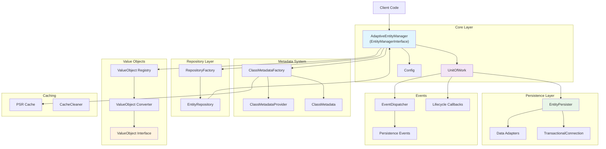
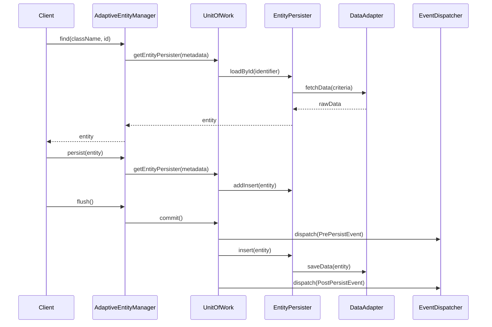
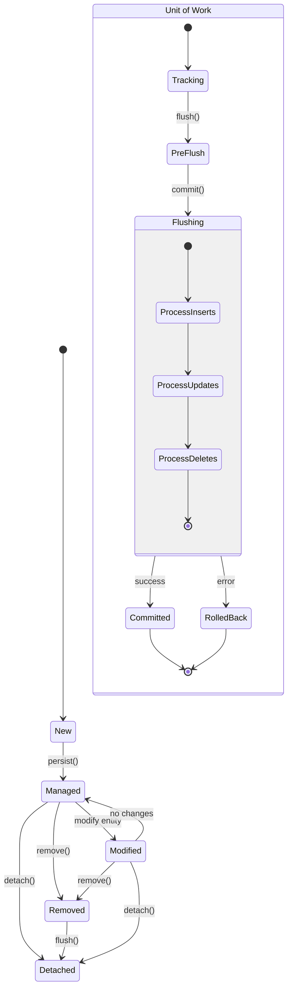
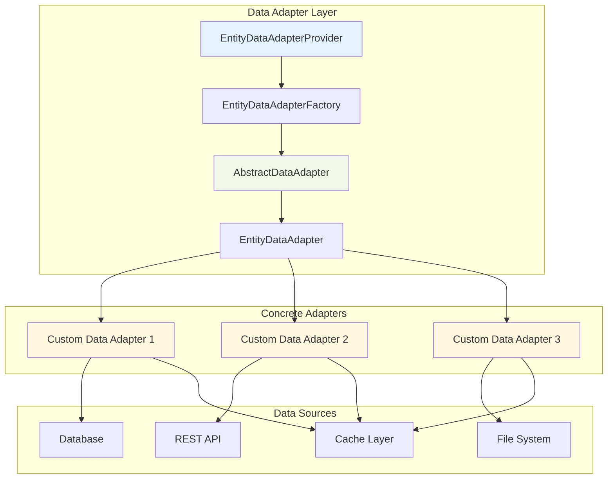
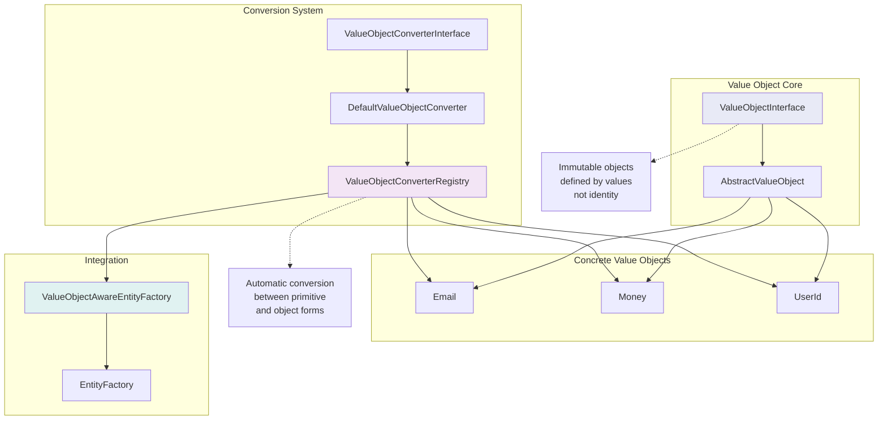
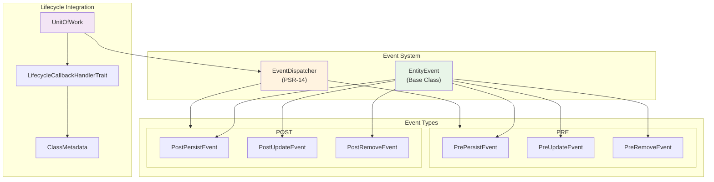
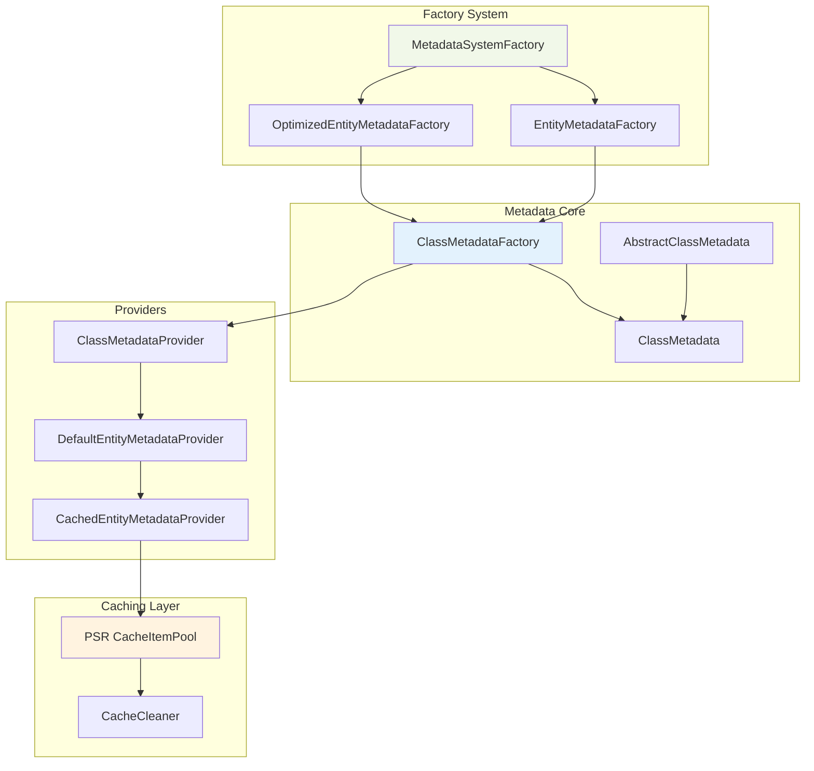

# Architecture Diagrams

Этот документ содержит диаграммы архитектуры Adaptive Entity Manager.

## 1. Общая архитектура системы

## 2. Entity Manager и его взаимодействия

## 3. Unit of Work Pattern

## 4. Data Adapter System

## 5. Value Object System

## 6. Event System и Lifecycle

## 7. Metadata System

## Заключение

Adaptive Entity Manager представляет собой модульную архитектуру ORM с следующими ключевыми особенностями:

- **Адаптивность**: Поддержка различных источников данных через систему адаптеров
- **Value Objects**: Встроенная поддержка объектов-значений с автоматической конвертацией
- **Events**: Полная система событий жизненного цикла сущностей
- **Caching**: Многоуровневое кеширование метаданных и данных
- **Unit of Work**: Эффективное управление изменениями и транзакциями
- **Extensibility**: Возможность расширения через интерфейсы и фабрики 