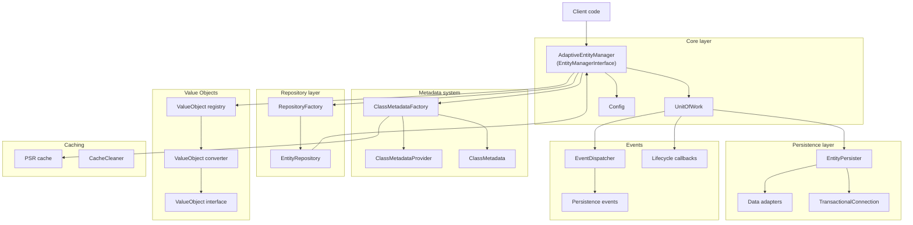
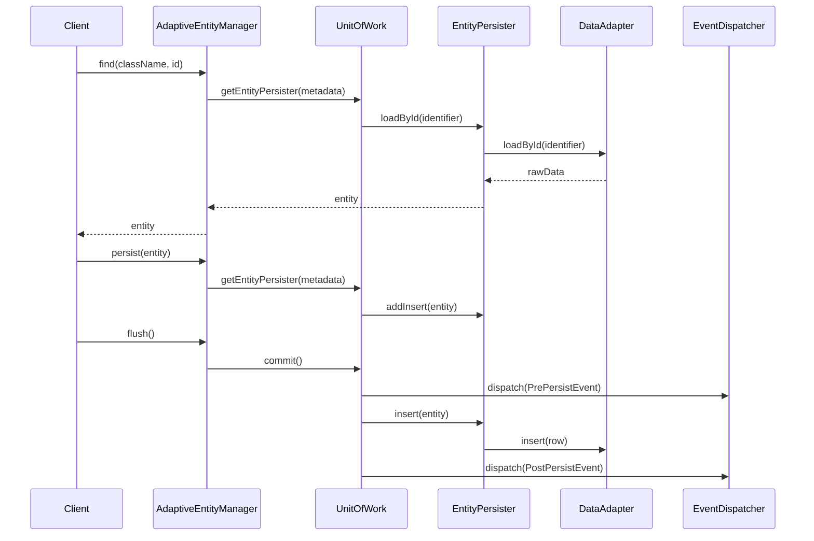
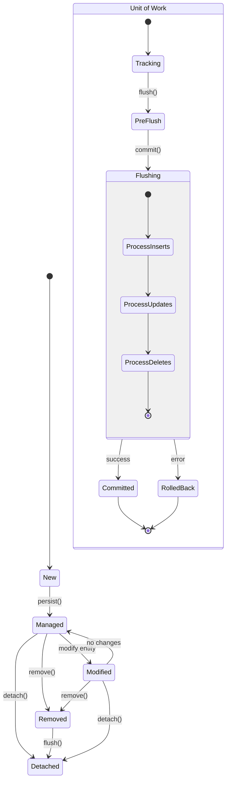
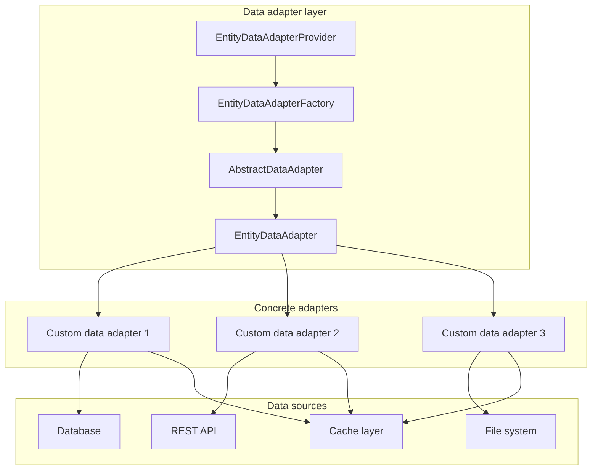
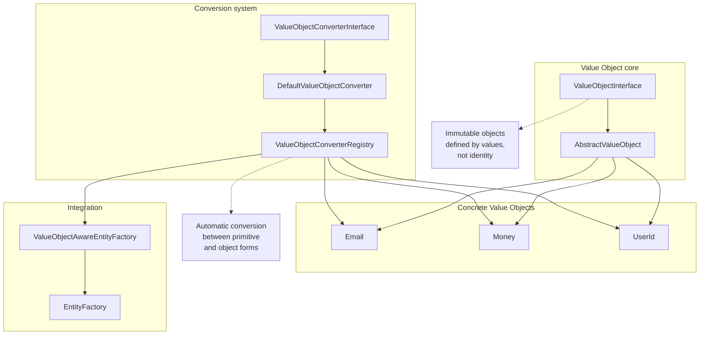
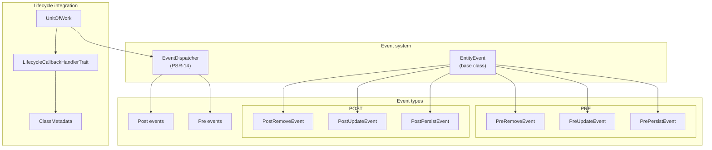
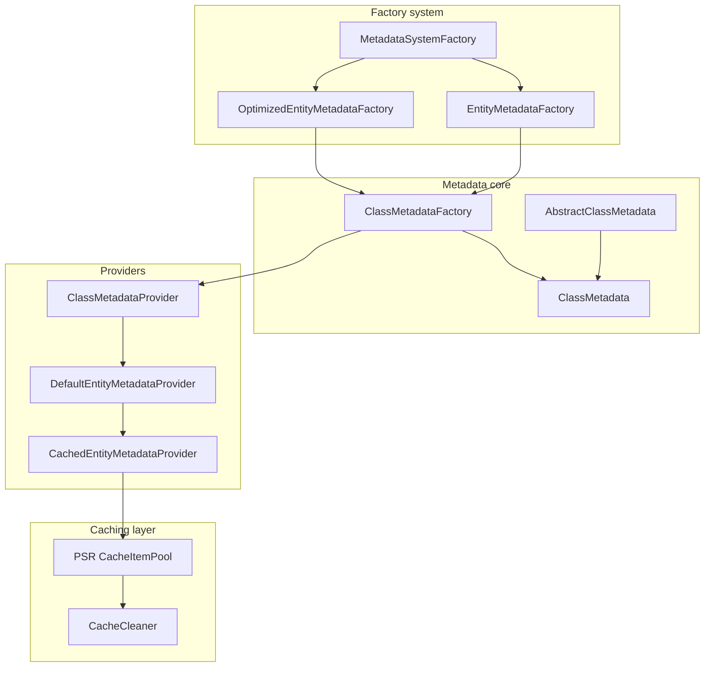

# Architecture diagrams

Diagrams for the Adaptive Entity Manager architecture.

## 1. Overall system architecture

```mermaid
graph TB
    Client["Client code"]

    subgraph coreLayer [Core layer]
        AEM["AdaptiveEntityManager<br/>(EntityManagerInterface)"]
        UOW["UnitOfWork"]
        Config["Config"]
    end

    subgraph persistenceLayer [Persistence layer]
        EP["EntityPersister"]
        DA["Data adapters"]
        TC["TransactionalConnection"]
    end

    subgraph metadataSystem [Metadata system]
        CMF["ClassMetadataFactory"]
        CMP["ClassMetadataProvider"]
        CM["ClassMetadata"]
    end

    subgraph repositoryLayer [Repository layer]
        RF["RepositoryFactory"]
        ER["EntityRepository"]
    end

    subgraph valueObjects [Value Objects]
        VO["ValueObject interface"]
        VOC["ValueObject converter"]
        VOR["ValueObject registry"]
    end

    subgraph events [Events]
        ED["EventDispatcher"]
        PE["Persistence events"]
        LC["Lifecycle callbacks"]
    end

    subgraph caching [Caching]
        Cache["PSR cache"]
        CC["CacheCleaner"]
    end

    Client --> AEM
    AEM --> UOW
    AEM --> CMF
    AEM --> RF
    AEM --> Config

    UOW --> EP
    EP --> DA
    EP --> TC

    CMF --> CMP
    CMF --> CM
    CMF --> Cache

    RF --> ER
    ER --> AEM

    AEM --> VOR
    VOR --> VOC
    VOC --> VO

    UOW --> ED
    ED --> PE
    UOW --> LC
```

## 2. Entity Manager interactions

```mermaid
sequenceDiagram
    participant Client
    participant AEM as AdaptiveEntityManager
    participant UOW as UnitOfWork
    participant EP as EntityPersister
    participant DA as DataAdapter
    participant ED as EventDispatcher

    Client->>AEM: find(className, id)
    AEM->>UOW: getEntityPersister(metadata)
    UOW->>EP: loadById(identifier)
    EP->>DA: loadById(identifier)
    DA-->>EP: rawData
    EP-->>AEM: entity
    AEM-->>Client: entity

    Client->>AEM: persist(entity)
    AEM->>UOW: getEntityPersister(metadata)
    UOW->>EP: addInsert(entity)

    Client->>AEM: flush()
    AEM->>UOW: commit()
    UOW->>ED: dispatch(PrePersistEvent)
    UOW->>EP: insert(entity)
    EP->>DA: insert(row)
    UOW->>ED: dispatch(PostPersistEvent)
```

## 3. Unit of Work pattern

```mermaid
stateDiagram-v2
    [*] --> New
    New --> Managed: persist()
    Managed --> Modified: modify entity
    Modified --> Managed: no changes
    Managed --> Removed: remove()
    Modified --> Removed: remove()

    state "Unit of Work" as UOW {
        [*] --> Tracking
        Tracking --> PreFlush: flush()
        PreFlush --> Flushing: commit()

        state Flushing {
            [*] --> ProcessInserts
            ProcessInserts --> ProcessUpdates
            ProcessUpdates --> ProcessDeletes
            ProcessDeletes --> [*]
        }

        Flushing --> Committed: success
        Flushing --> RolledBack: error
        Committed --> [*]
        RolledBack --> [*]
    }

    Managed --> Detached: detach()
    Removed --> Detached: flush()
    Modified --> Detached: detach()
```

## 4. Data adapter system

```mermaid
graph TB
    subgraph adapterLayer [Data adapter layer]
        EDAP["EntityDataAdapterProvider"]
        EDAF["EntityDataAdapterFactory"]
        ADA["AbstractDataAdapter"]
        EDA["EntityDataAdapter"]
    end

    subgraph concreteAdapters [Concrete adapters]
        CDA1["Custom data adapter 1"]
        CDA2["Custom data adapter 2"]
        CDA3["Custom data adapter 3"]
    end

    subgraph dataSources [Data sources]
        DB["Database"]
        API["REST API"]
        File["File system"]
        Cache2["Cache layer"]
    end

    EDAP --> EDAF
    EDAF --> ADA
    ADA --> EDA
    EDA --> CDA1
    EDA --> CDA2
    EDA --> CDA3

    CDA1 --> DB
    CDA2 --> API
    CDA3 --> File

    CDA1 --> Cache2
    CDA2 --> Cache2
    CDA3 --> Cache2
```

## 5. Value Object system

```mermaid
graph TB
    subgraph voCore [Value Object core]
        VOI["ValueObjectInterface"]
        AVO["AbstractValueObject"]
    end

    subgraph concreteVO [Concrete Value Objects]
        Email["Email"]
        Money["Money"]
        UserId["UserId"]
    end

    subgraph conversion [Conversion system]
        VOCI["ValueObjectConverterInterface"]
        DVOC["DefaultValueObjectConverter"]
        VOCR["ValueObjectConverterRegistry"]
    end

    subgraph integration [Integration]
        VOAEF["ValueObjectAwareEntityFactory"]
        EntityFactory["EntityFactory"]
    end

    VOI --> AVO
    AVO --> Email
    AVO --> Money
    AVO --> UserId

    VOCI --> DVOC
    DVOC --> VOCR
    VOCR --> Email
    VOCR --> Money
    VOCR --> UserId

    VOCR --> VOAEF
    VOAEF --> EntityFactory

    note1["Immutable objects<br/>defined by values,<br/>not identity"]
    note2["Automatic conversion<br/>between primitive<br/>and object forms"]

    VOI -.-> note1
    VOCR -.-> note2
```

## 6. Event system and lifecycle

```mermaid
graph TB
    subgraph eventTypes [Event types]
        PRE["Pre events"]
        POST["Post events"]

        subgraph preEvents [PRE]
            PrePersist["PrePersistEvent"]
            PreUpdate["PreUpdateEvent"]
            PreRemove["PreRemoveEvent"]
        end

        subgraph postEvents [POST]
            PostPersist["PostPersistEvent"]
            PostUpdate["PostUpdateEvent"]
            PostRemove["PostRemoveEvent"]
        end
    end

    subgraph eventSystem [Event system]
        ED["EventDispatcher<br/>(PSR-14)"]
        EntityEvent["EntityEvent<br/>(base class)"]
    end

    subgraph lifecycleIntegration [Lifecycle integration]
        UOW2["UnitOfWork"]
        LCHT["LifecycleCallbackHandlerTrait"]
        CM2["ClassMetadata"]
    end

    EntityEvent --> PrePersist
    EntityEvent --> PreUpdate
    EntityEvent --> PreRemove
    EntityEvent --> PostPersist
    EntityEvent --> PostUpdate
    EntityEvent --> PostRemove

    UOW2 --> ED
    UOW2 --> LCHT
    LCHT --> CM2

    ED --> PRE
    ED --> POST
```

## 7. Metadata system

```mermaid
graph TB
    subgraph metadataCore [Metadata core]
        CMF2["ClassMetadataFactory"]
        CM3["ClassMetadata"]
        ACM["AbstractClassMetadata"]
    end

    subgraph providers [Providers]
        CMP2["ClassMetadataProvider"]
        DEMP["DefaultEntityMetadataProvider"]
        CEMP["CachedEntityMetadataProvider"]
    end

    subgraph factorySystem [Factory system]
        EMF["EntityMetadataFactory"]
        OEMF["OptimizedEntityMetadataFactory"]
        MSF["MetadataSystemFactory"]
    end

    subgraph cachingLayer [Caching layer]
        CachePool["PSR CacheItemPool"]
        CacheCleaner["CacheCleaner"]
    end

    ACM --> CM3
    CMF2 --> CM3

    CMP2 --> DEMP
    DEMP --> CEMP
    CEMP --> CachePool

    EMF --> CMF2
    OEMF --> CMF2
    MSF --> EMF
    MSF --> OEMF

    CMF2 --> CMP2
    CachePool --> CacheCleaner
```

## Summary

Adaptive Entity Manager is a modular mapping architecture with:

- **Adaptability:** pluggable adapters for many data sources
- **Value Objects:** conversion between primitives and domain types
- **Events:** lifecycle hooks around persistence
- **Caching:** metadata and related infrastructure caching
- **Unit of Work:** change batching and transactional boundaries
- **Extensibility:** interfaces and factories for customization
