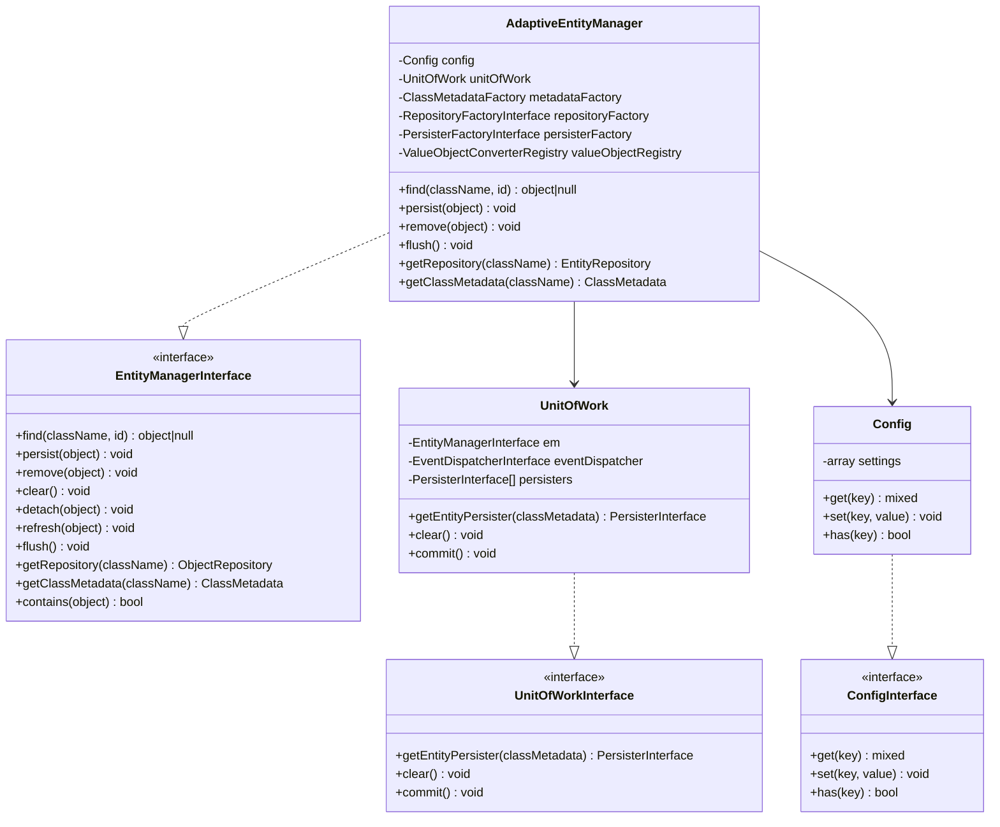
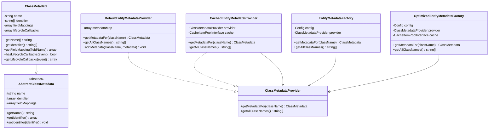
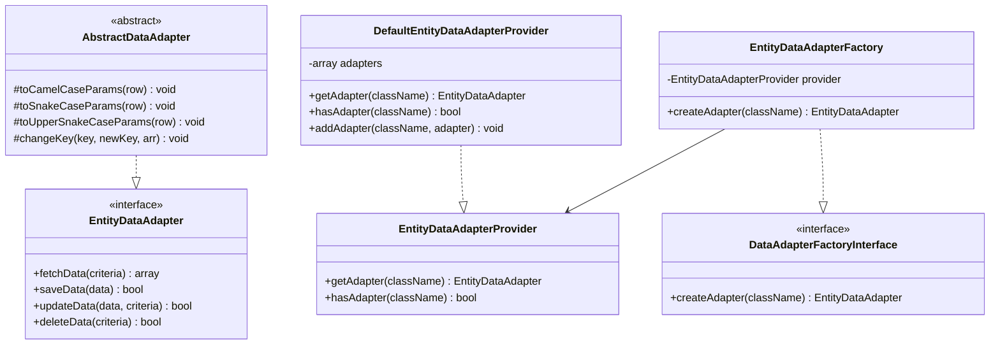
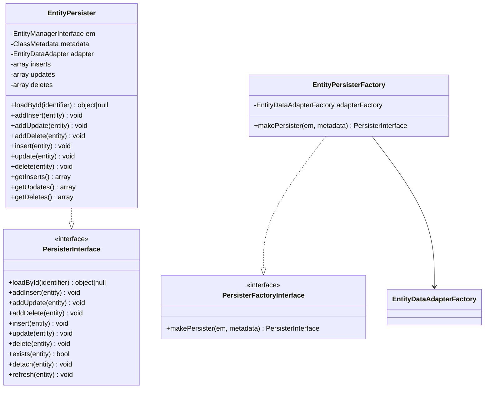
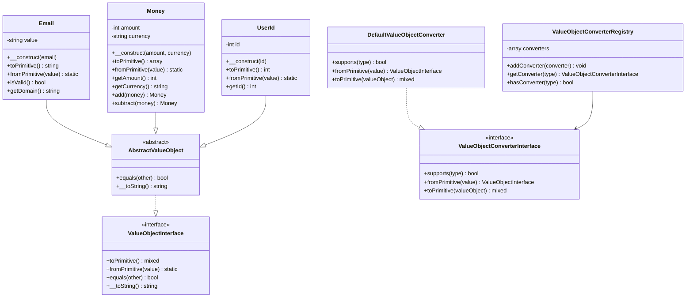
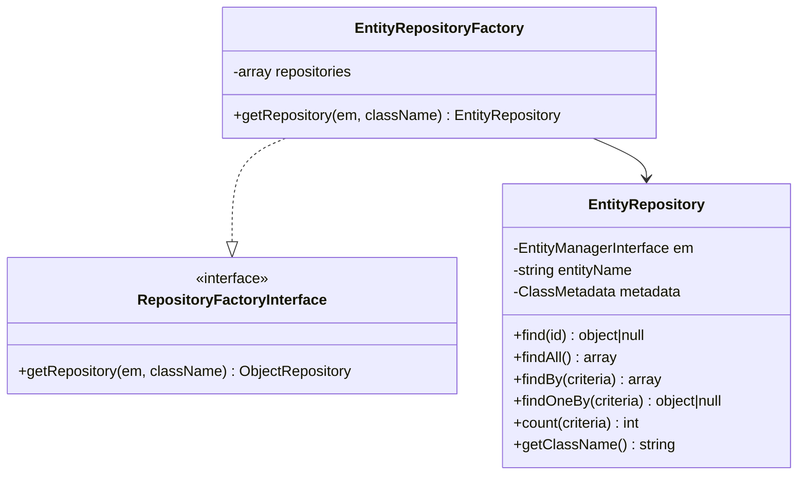
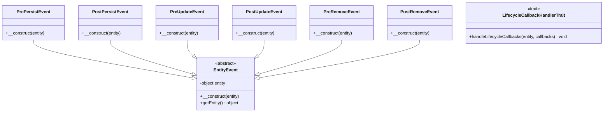
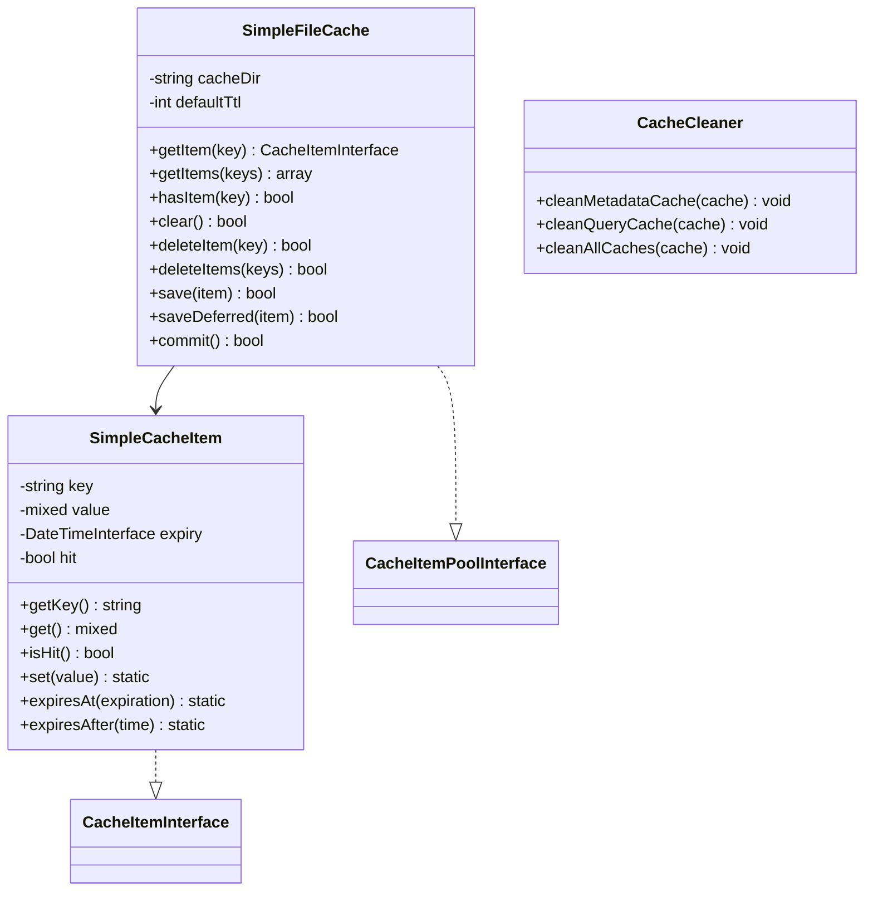
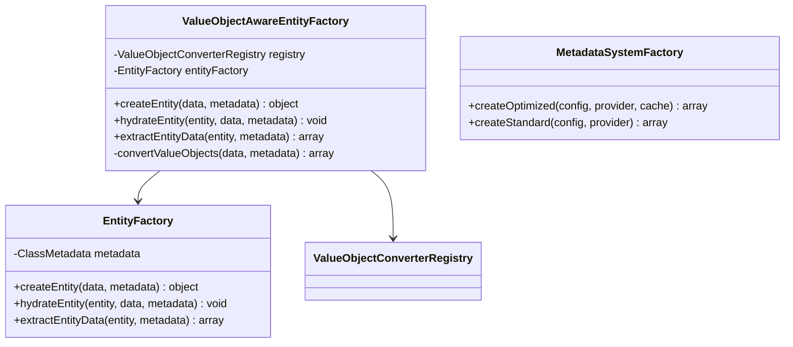
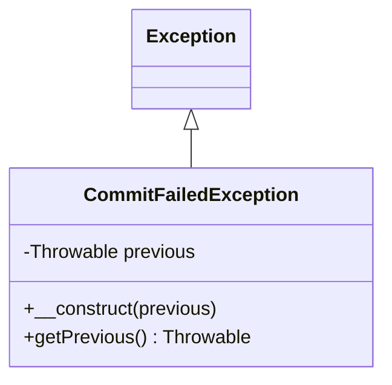

# Диаграммы классов

Этот документ содержит UML диаграммы классов Adaptive Entity Manager, показывающие структуру и взаимосвязи основных компонентов.

## 1. Core Entity Manager Classes

## 2. Metadata System Classes

## 3. Data Adapter Classes

## 4. Persistence Layer Classes

## 5. Value Object Classes

## 6. Repository Classes

## 7. Event System Classes

## 8. Cache Classes

## 9. Factory Classes

## 10. Exception Classes

## Заключение

Эти диаграммы классов показывают:

- **Четкое разделение ответственности** между различными слоями архитектуры
- **Использование интерфейсов** для обеспечения гибкости и тестируемости
- **Паттерны проектирования**: Factory, Repository, Unit of Work, Value Object
- **Расширяемость** через абстрактные классы и интерфейсы
- **Инверсию зависимостей** для слабой связанности компонентов

Архитектура следует принципам SOLID и обеспечивает высокую модульность и возможность тестирования. 