# 🔄 Сравнение с Doctrine ORM

Adaptive Entity Manager был создан не как конкурент Doctrine ORM, а как **специализированный инструмент для миграции монолитных приложений** и постепенного перехода на Doctrine. Этот документ показывает архитектурные различия и объясняет назначение каждого решения.

## 📊 Сравнительная диаграмма архитектур

```mermaid
graph TD
    subgraph "🏗️ Adaptive Entity Manager Flow"
        AEM_BL["Business Layer"]
        AEM_Entity["Entity"]
        AEM_Repo["Repository"]
        AEM_Manager["AdaptiveEntityManager"]
        AEM_UOW["UnitOfWork"]
        AEM_Persister["EntityPersister"]
        AEM_Adapter["DataAdapter"]
        AEM_DS["Data Source<br/>(DB/API/File)"]
        
        AEM_BL --> AEM_Entity
        AEM_Entity --> AEM_Repo
        AEM_Repo --> AEM_Manager
        AEM_Manager --> AEM_UOW
        AEM_UOW --> AEM_Persister
        AEM_Persister --> AEM_Adapter
        AEM_Adapter --> AEM_DS
    end
    
    subgraph "🏛️ Doctrine ORM Flow"
        DOC_BL["Business Layer"]
        DOC_Entity["Entity"]
        DOC_Repo["Repository"]
        DOC_Manager["EntityManager"]
        DOC_UOW["UnitOfWork"]
        DOC_Persister["EntityPersister"]
        DOC_DBAL["DBAL"]
        DOC_DB["Database"]
        
        DOC_BL --> DOC_Entity
        DOC_Entity --> DOC_Repo
        DOC_Repo --> DOC_Manager
        DOC_Manager --> DOC_UOW
        DOC_UOW --> DOC_Persister
        DOC_Persister --> DOC_DBAL
        DOC_DBAL --> DOC_DB
    end
    
    %% Styling
    classDef aemStyle fill:#e3f2fd,stroke:#1976d2,stroke-width:2px
    classDef docStyle fill:#fff3e0,stroke:#f57c00,stroke-width:2px
    classDef businessStyle fill:#e8f5e8,stroke:#388e3c,stroke-width:2px
    classDef dataStyle fill:#fce4ec,stroke:#c2185b,stroke-width:2px
    
    class AEM_BL,DOC_BL businessStyle
    class AEM_Entity,AEM_Repo,AEM_Manager,AEM_UOW,AEM_Persister,AEM_Adapter aemStyle
    class DOC_Entity,DOC_Repo,DOC_Manager,DOC_UOW,DOC_Persister,DOC_DBAL docStyle
    class AEM_DS,DOC_DB dataStyle
```



## 🎯 Назначение и цели

### Adaptive Entity Manager
**Цель**: Инструмент для поэтапной миграции и разбиения монолита
- 🔧 **Переходный период**: Помогает мигрировать с legacy систем на современные решения
- 🏗️ **Разбиение монолита**: Позволяет выделять сервисы с разными источниками данных
- 🔄 **Постепенный переход**: Обеспечивает мягкую миграцию на Doctrine
- 🎛️ **Гибкость источников**: Работает с DB, API, файлами одновременно

### Doctrine ORM
**Цель**: Полнофункциональная промышленная ORM для долгосрочного использования
- 🏛️ **Production-ready**: Зрелое решение для крупных проектов  
- 📊 **Реляционные БД**: Мощная работа с SQL базами данных
- 🔍 **DQL**: Объектно-ориентированный язык запросов
- 🛡️ **Стабильность**: Многолетняя экосистема и поддержка

## ⚡ Анализ различий

### Архитектурные различия

| Аспект | Adaptive Entity Manager | Doctrine ORM |
|--------|------------------------|--------------|
| **Слои абстракции** | Меньше (7 слоев) | Больше (8 слоев) |
| **Источники данных** | Любые (DB/API/Files) | Только реляционные БД |
| **Адаптер данных** | `DataAdapter` (универсальный) | `DBAL` (только SQL) |
| **Сложность настройки** | Простая | Более сложная |
| **Время запуска** | Быстрее | Медленнее |

### 🟢 Преимущества Adaptive Entity Manager

**Для миграционных проектов:**
- ✅ **Быстрый старт**: Можно подключить к любому источнику данных за минуты
- ✅ **Гибридная архитектура**: Одновременная работа с БД и API в одном приложении
- ✅ **Малый overhead**: Минимальные накладные расходы на абстракции
- ✅ **Value Objects из коробки**: Встроенная поддержка без дополнительной настройки
- ✅ **Простая отладка**: Меньше слоев = проще найти проблему
- ✅ **Легкий рефакторинг**: Постепенная замена адаптеров без изменения бизнес-логики

**Техническая производительность:**
- 🚀 **Меньше вызовов**: Прямая связь EntityPersister → DataAdapter
- 🚀 **Быстрая гидратация**: Упрощенный процесс создания объектов
- 🚀 **Кеширование на уровне адаптера**: Более гранулярный контроль

### 🔴 Ограничения Adaptive Entity Manager

**Что НЕ является целью:**
- ❌ **Не для production на годы**: Это переходное решение
- ❌ **Ограниченный функционал**: Нет сложных связей как в Doctrine  
- ❌ **Нет экосистемы**: Нет готовых бандлов, миграций, консольных команд
- ❌ **Простые запросы**: Нет аналога DQL для сложных выборок
- ❌ **Мало готовых решений**: Меньше документации и туториалов

### 🟡 Преимущества Doctrine ORM

**Для долгосрочных проектов:**
- ✅ **Промышленная зрелость**: Годы использования в крупных проектах
- ✅ **Богатая экосистема**: Symfony интеграция, миграции, консольные команды
- ✅ **DQL**: Мощный язык запросов для сложной бизнес-логики
- ✅ **Связи и ассоциации**: Полная поддержка реляционных связей
- ✅ **Расширения**: Gedmo, Stof, множество готовых решений
- ✅ **Сообщество**: Большое комьюнити и поддержка

### 🔴 Ограничения Doctrine ORM

**Для миграционных проектов:**
- ❌ **Сложность настройки**: Требует серьезной подготовки метаданных
- ❌ **Только SQL БД**: Невозможно работать с API или файлами как с сущностями
- ❌ **Тяжелый DBAL**: Дополнительный слой абстракции для простых операций
- ❌ **Медленный старт**: Долгая настройка для простых задач
- ❌ **Overhead**: Много памяти и вычислений для небольших проектов

## 🛣️ Стратегия миграции

### Этап 1: Внедрение Adaptive Entity Manager
```php
// Подключаем AEM к существующему legacy коду
$entityManager = new AdaptiveEntityManager($config);

// Создаем адаптеры для текущих источников данных
$legacyDbAdapter = new LegacyDatabaseAdapter($oldConnection);
$newApiAdapter = new ModernApiAdapter($httpClient);
```

### Этап 2: Постепенное выделение сервисов
```php
// Часть данных уже в новом API
$userService = new UserService($entityManager);
$users = $userService->findActiveUsers(); // Работает с API

// Часть еще в старой БД  
$orderService = new OrderService($entityManager);
$orders = $orderService->findUserOrders($userId); // Работает с legacy DB
```

### Этап 3: Миграция на Doctrine
```php
// Когда данные унифицированы, переходим на Doctrine
$doctrineEntityManager = EntityManager::create($connection, $config);

// Меняем только инфраструктурный слой
// Бизнес-логика остается той же!
```

## 🎯 Когда использовать что?

### Используйте Adaptive Entity Manager если:
- 🔄 **Мигрируете монолит** на микросервисы
- 🏗️ **Разбиваете legacy** систему на части  
- 🔌 **Работаете с разными источниками** данных одновременно
- ⚡ **Нужен быстрый результат** без долгой настройки
- 🎛️ **Требуется гибкость** в выборе хранилищ данных
- 📦 **Внедряете Value Objects** в существующий код

### Переходите на Doctrine ORM когда:
- 🏗️ **Архитектура стабилизировалась** и источники данных определены
- 📊 **Нужны сложные запросы** и связи между сущностями
- 🛡️ **Проект переходит в production** на долгий срок
- 👥 **В команде есть Doctrine эксперты**
- 🔍 **Требуется DQL** для сложной аналитики
- 🏛️ **Нужна экосистема** бандлов и расширений

## 💡 Примеры реальных сценариев

### Сценарий 1: E-commerce миграция
```
Legacy монолит → AEM (разбиение на сервисы) → Doctrine (итоговая архитектура)

Пользователи: старая БД → новый API → PostgreSQL
Товары: файлы CSV → REST API → MySQL  
Заказы: legacy БД → message queue → MongoDB
```

### Сценарий 2: CRM модернизация
```
Старый CRM → AEM (поэтапная миграция) → Doctrine (финальная система)

Контакты: Access БД → временный API → PostgreSQL
Документы: файловая система → S3 API → PostgreSQL
Отчеты: Excel файлы → BI система → PostgreSQL
```

## 🤝 Заключение

**Adaptive Entity Manager** - это не конкурент Doctrine, а **союзник в процессе миграции**. Он решает специфическую задачу: помочь безболезненно перейти от legacy архитектуры к современным решениям.

### Формула успеха:
```
Legacy Монолит + AEM → Промежуточная Архитектура → Doctrine ORM
```

**Цель**: Не заменить Doctrine, а **подготовить почву** для его успешного внедрения!

---

*Помните: лучший код - это код, который решает реальную задачу. AEM решает задачу миграции, Doctrine решает задачу долгосрочной разработки. Используйте правильный инструмент для правильной задачи! 🛠️* 