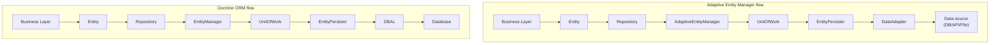

# Comparison with Doctrine ORM

Adaptive Entity Manager was not built to compete with Doctrine ORM. It is a **specialized tool for migrating monolithic applications** and gradually moving toward Doctrine. This document explains the architectural differences and what each solution is for.

## Architecture comparison


```mermaid
graph TD
    subgraph aemFlow [Adaptive Entity Manager flow]
        AEM_BL["Business Layer"]
        AEM_Entity["Entity"]
        AEM_Repo["Repository"]
        AEM_Manager["AdaptiveEntityManager"]
        AEM_UOW["UnitOfWork"]
        AEM_Persister["EntityPersister"]
        AEM_Adapter["DataAdapter"]
        AEM_DS["Data source<br/>(DB/API/File)"]

        AEM_BL --> AEM_Entity
        AEM_Entity --> AEM_Repo
        AEM_Repo --> AEM_Manager
        AEM_Manager --> AEM_UOW
        AEM_UOW --> AEM_Persister
        AEM_Persister --> AEM_Adapter
        AEM_Adapter --> AEM_DS
    end

    subgraph doctrineFlow [Doctrine ORM flow]
        DOC_BL["Business Layer"]
        DOC_Entity["Entity"]
        DOC_Repo["Repository"]
        DOC_Manager["EntityManager"]
        DOC_UOW["UnitOfWork"]
        DOC_Persister["EntityPersister"]
        DOC_DBAL["DBAL"]
        DOC_DB["Database"]

        DOC_BL --> DOC_Entity
        DOC_Entity --> DOC_Repo
        DOC_Repo --> DOC_Manager
        DOC_Manager --> DOC_UOW
        DOC_UOW --> DOC_Persister
        DOC_Persister --> DOC_DBAL
        DOC_DBAL --> DOC_DB
    end
```

## Purpose and goals

### Adaptive Entity Manager

**Goal:** incremental migration and splitting a monolith.

- **Transition period:** helps move from legacy stacks to modern stacks
- **Monolith decomposition:** services can use different data sources
- **Gradual path:** smooth stepping stone toward Doctrine
- **Source flexibility:** DB, HTTP APIs, files, and more in one app

### Doctrine ORM

**Goal:** full-featured, long-lived ORM for relational persistence.

- **Production-grade:** mature choice for large projects
- **Relational databases:** deep SQL integration
- **DQL:** object-oriented query language
- **Stability:** large ecosystem and long-term support

## Key differences

### Architectural differences

| Aspect | Adaptive Entity Manager | Doctrine ORM |
|--------|-------------------------|--------------|
| **Abstraction depth** | Fewer layers (about 7) | More layers (about 8) |
| **Data sources** | Any (DB/API/files) | Relational databases |
| **Data access** | `DataAdapter` (pluggable) | `DBAL` (SQL) |
| **Setup complexity** | Relatively simple | More involved |
| **Time to first value** | Usually faster | Usually slower |

### Strengths of Adaptive Entity Manager

**For migration-style projects:**

- **Fast start:** wire a new data source in minutes
- **Hybrid architecture:** DB and APIs side by side
- **Low overhead:** fewer abstraction layers
- **Value Objects:** built-in conversion support
- **Easier debugging:** fewer layers to trace
- **Incremental refactors:** swap adapters without rewriting domain code

**Technical performance:**

- **Fewer hops:** straight path `EntityPersister` → `DataAdapter`
- **Simpler hydration:** lighter object creation path
- **Adapter-level caching:** fine-grained control

### Limitations of Adaptive Entity Manager

**Not the primary goal:**

- **Not “ORM for the next decade”:** positioned as a transitional mapper
- **Narrower feature set:** no Doctrine-grade association graph
- **Smaller ecosystem:** fewer bundles, migrations, console tools out of the box
- **Query power:** no DQL equivalent for heavy reporting
- **Less community material:** fewer tutorials and plugins

### Strengths of Doctrine ORM

**For long-running projects:**

- **Industrial maturity:** proven in large systems
- **Rich ecosystem:** Symfony integration, migrations, CLI
- **DQL:** powerful queries for complex domains
- **Associations:** full relational modeling
- **Extensions:** Gedmo, Stof, and many others
- **Community:** large support surface

### Limitations of Doctrine ORM

**For migration-heavy situations:**

- **Heavier setup:** metadata and mapping discipline required
- **SQL-centric:** APIs and files are not first-class “entities”
- **DBAL weight:** more abstraction than some small tasks need
- **Slower bootstrap:** setup cost for quick experiments
- **Runtime cost:** more memory and work for tiny apps

## Migration strategy

### Phase 1: Introduce Adaptive Entity Manager

```php
// Connect AEM to existing legacy code
$entityManager = new AdaptiveEntityManager($config);

// Add adapters for current data sources
$legacyDbAdapter = new LegacyDatabaseAdapter($oldConnection);
$newApiAdapter = new ModernApiAdapter($httpClient);
```

### Phase 2: Gradually extract services

```php
// Some data already lives behind a new API
$userService = new UserService($entityManager);
$users = $userService->findActiveUsers(); // API-backed

// Some data still in legacy DB
$orderService = new OrderService($entityManager);
$orders = $orderService->findUserOrders($userId); // legacy DB
```

### Phase 3: Move to Doctrine

```php
// When data and boundaries stabilize, adopt Doctrine
$doctrineEntityManager = EntityManager::create($connection, $config);

// Change the infrastructure layer
// Domain logic can stay similar
```

## When to use which

### Choose Adaptive Entity Manager when

- **Migrating a monolith** toward services
- **Splitting legacy** into bounded pieces
- **Multiple data sources** must coexist
- **You need speed** without weeks of ORM setup
- **Storage flexibility** matters (DB + API + files)
- **Value Objects** can be introduced into brownfield code

### Choose Doctrine ORM when

- **Architecture has stabilized** and sources are well defined
- **Complex queries and associations** are central
- **Long production lifetime** is expected
- **The team knows Doctrine** well
- **DQL** is required for analytics or heavy reads
- **Ecosystem features** (migrations, bundles) matter

## Example scenarios

### Scenario 1: e-commerce modernization

```
Legacy monolith → AEM (service extraction) → Doctrine (target architecture)

Users: old DB → new API → PostgreSQL
Products: CSV files → REST API → MySQL
Orders: legacy DB → message queue → MongoDB
```

### Scenario 2: CRM modernization

```
Legacy CRM → AEM (incremental migration) → Doctrine (final stack)

Contacts: Access DB → interim API → PostgreSQL
Documents: filesystem → S3 API → PostgreSQL
Reports: Excel exports → BI system → PostgreSQL
```

## Conclusion

**Adaptive Entity Manager** is not Doctrine’s competitor; it is **a migration ally**. It targets a specific problem: moving from legacy layouts toward modern persistence without a big-bang rewrite.

### Success pattern

```
Legacy monolith + AEM → interim architecture → Doctrine ORM
```

**Aim:** not to replace Doctrine, but to **make Doctrine adoption realistic**.

---

*Pick the tool for the job: AEM fits migration and multi-source mapping; Doctrine fits long-term relational ORM.*
