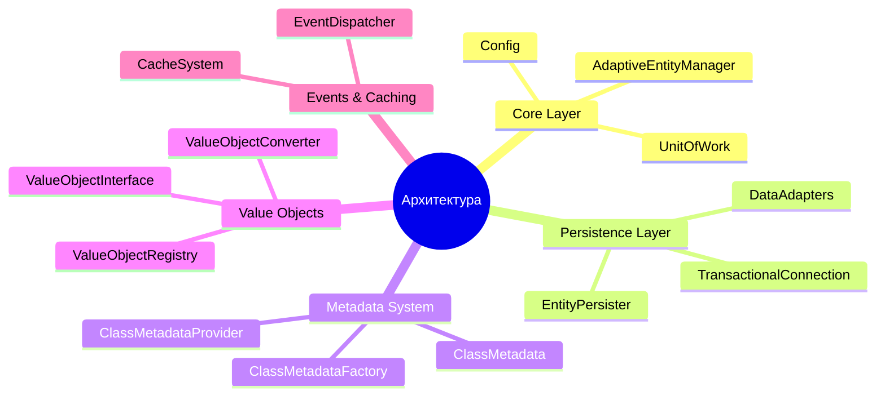
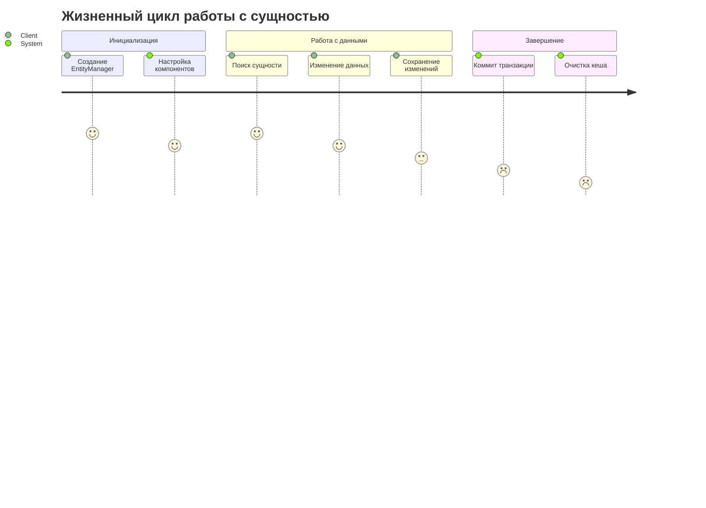
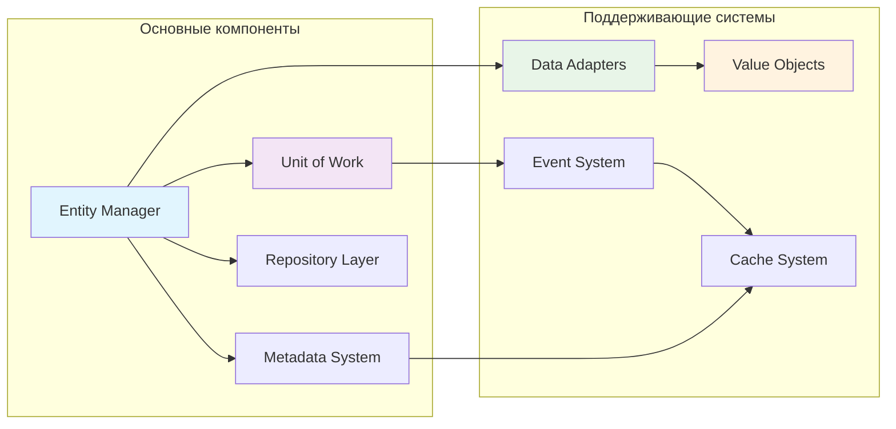

# 📊 Индекс диаграмм Adaptive Entity Manager

Добро пожаловать в коллекцию диаграмм архитектуры Adaptive Entity Manager! Этот документ содержит навигацию по всем диаграммам проекта.

## 🎯 Обзор проекта

Adaptive Entity Manager — это гибкая PHP ORM библиотека, которая предоставляет адаптивный подход к управлению сущностями с поддержкой различных источников данных, Value Objects, и событийной системы.

### Ключевые особенности:
- 🔄 **Адаптивные источники данных** через систему адаптеров
- 💎 **Value Objects** с автоматической конверсией
- 🎭 **Система событий** для жизненного цикла сущностей
- 🚀 **Многоуровневое кеширование** для производительности
- 📦 **Unit of Work** для управления изменениями
- 🔧 **Расширяемость** через интерфейсы и фабрики

## 📚 Коллекция диаграмм

### 1. [Архитектурные диаграммы](./ARCHITECTURE_DIAGRAMS.md)
**Общий обзор системы и ее компонентов**

**Включает:**
- 🏗️ Общая архитектура системы
- 🔄 Entity Manager и его взаимодействия
- 📊 Unit of Work Pattern
- 🔌 Data Adapter System
- 💎 Value Object System
- 📡 Event System и Lifecycle
- 🗃️ Metadata System

### 2. [Диаграммы взаимодействий](./INTERACTION_DIAGRAMS.md)
**Детальные процессы и взаимодействия компонентов**

**Включает:**
- 🚀 Процесс инициализации Entity Manager
- 🔄 Жизненный цикл сущности
- 🔍 Процесс выполнения запроса
- 💾 Процесс коммита (flush)
- 🔄 Value Object Conversion Flow
- 🗃️ Caching Strategy
- ⚠️ Error Handling и Exception Flow

### 3. [Диаграммы классов](./CLASS_DIAGRAMS.md)
**UML структура классов и их взаимосвязи**

**Включает:**
- 🏛️ Core Entity Manager Classes
- 📊 Metadata System Classes
- 🔌 Data Adapter Classes
- 💾 Persistence Layer Classes
- 💎 Value Object Classes
- 📦 Repository Classes
- 📡 Event System Classes
- 🗃️ Cache Classes
- 🏭 Factory Classes
- ⚠️ Exception Classes

## 🗺️ Навигационная карта

### Для разработчиков, начинающих работу с проектом:
1. Начните с [архитектурных диаграмм](./ARCHITECTURE_DIAGRAMS.md) для понимания общей структуры
2. Изучите [диаграммы классов](./CLASS_DIAGRAMS.md) для понимания объектной модели
3. Просмотрите [диаграммы взаимодействий](./INTERACTION_DIAGRAMS.md) для понимания процессов

### Для архитекторов и ведущих разработчиков:
1. [Архитектурные диаграммы](./ARCHITECTURE_DIAGRAMS.md) → Общее видение системы
2. [Диаграммы взаимодействий](./INTERACTION_DIAGRAMS.md) → Детали реализации
3. [Диаграммы классов](./CLASS_DIAGRAMS.md) → Техническая реализация

### Для DevOps и администраторов:
1. Кеширование и производительность → [Архитектурные диаграммы](./ARCHITECTURE_DIAGRAMS.md)
2. Обработка ошибок → [Диаграммы взаимодействий](./INTERACTION_DIAGRAMS.md)
3. Конфигурация → [Диаграммы классов](./CLASS_DIAGRAMS.md)

## 🔍 Быстрый поиск диаграмм

| Тема | Файл | Диаграмма |
|------|------|-----------|
| Общая архитектура | [ARCHITECTURE_DIAGRAMS.md](./ARCHITECTURE_DIAGRAMS.md) | #1 |
| Unit of Work | [ARCHITECTURE_DIAGRAMS.md](./ARCHITECTURE_DIAGRAMS.md) | #3 |
| Адаптеры данных | [ARCHITECTURE_DIAGRAMS.md](./ARCHITECTURE_DIAGRAMS.md) | #4 |
| Value Objects | [ARCHITECTURE_DIAGRAMS.md](./ARCHITECTURE_DIAGRAMS.md) | #5 |
| События | [ARCHITECTURE_DIAGRAMS.md](./ARCHITECTURE_DIAGRAMS.md) | #6 |
| Инициализация | [INTERACTION_DIAGRAMS.md](./INTERACTION_DIAGRAMS.md) | #1 |
| Жизненный цикл | [INTERACTION_DIAGRAMS.md](./INTERACTION_DIAGRAMS.md) | #2 |
| Выполнение запросов | [INTERACTION_DIAGRAMS.md](./INTERACTION_DIAGRAMS.md) | #3 |
| Процесс коммита | [INTERACTION_DIAGRAMS.md](./INTERACTION_DIAGRAMS.md) | #4 |
| Кеширование | [INTERACTION_DIAGRAMS.md](./INTERACTION_DIAGRAMS.md) | #6 |
| Обработка ошибок | [INTERACTION_DIAGRAMS.md](./INTERACTION_DIAGRAMS.md) | #7 |
| Основные классы | [CLASS_DIAGRAMS.md](./CLASS_DIAGRAMS.md) | #1 |
| Система метаданных | [CLASS_DIAGRAMS.md](./CLASS_DIAGRAMS.md) | #2 |
| Персистенция | [CLASS_DIAGRAMS.md](./CLASS_DIAGRAMS.md) | #4 |
| Репозитории | [CLASS_DIAGRAMS.md](./CLASS_DIAGRAMS.md) | #6 |

## 📋 Легенда символов

| Символ | Значение |
|--------|----------|
| 🏗️ | Архитектура и структура |
| 🔄 | Процессы и циклы |
| 💾 | Персистенция и хранение |
| 🔍 | Поиск и запросы |
| 📡 | События и коммуникации |
| 🗃️ | Кеширование и оптимизация |
| ⚠️ | Обработка ошибок |
| 🔧 | Конфигурация и настройка |
| 💎 | Value Objects |
| 📦 | Компоненты и модули |

## 🚀 Следующие шаги

После изучения диаграмм рекомендуется:

1. **Изучить примеры кода** в директории `examples/`
2. **Просмотреть тесты** в директории `tests/` для понимания использования
3. **Прочитать документацию** в файлах `VALUE_OBJECTS.md`, `CACHING.md`, `TESTING.md`
4. **Изучить исходный код** основных классов в директории `src/`

## 📞 Обратная связь

Если у вас есть вопросы по диаграммам или предложения по их улучшению, создайте issue в репозитории проекта.

---

*Диаграммы созданы с использованием Mermaid.js для обеспечения интерактивности и читаемости в GitHub/GitLab.* 