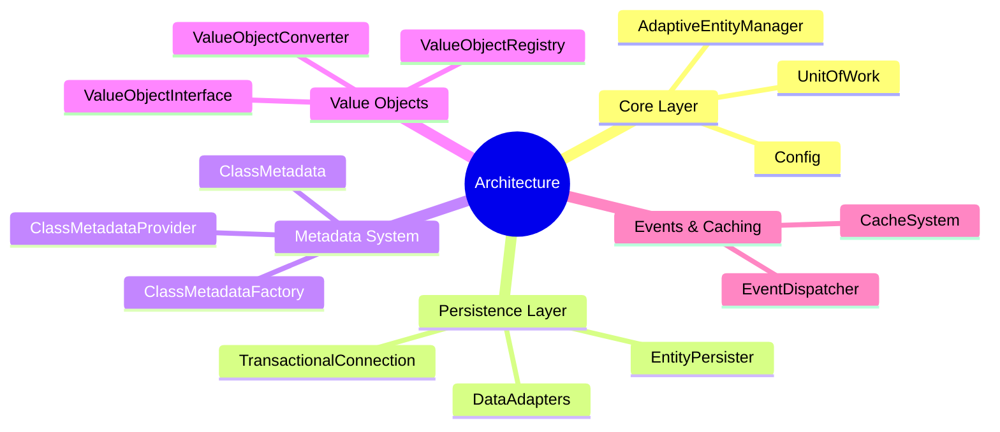
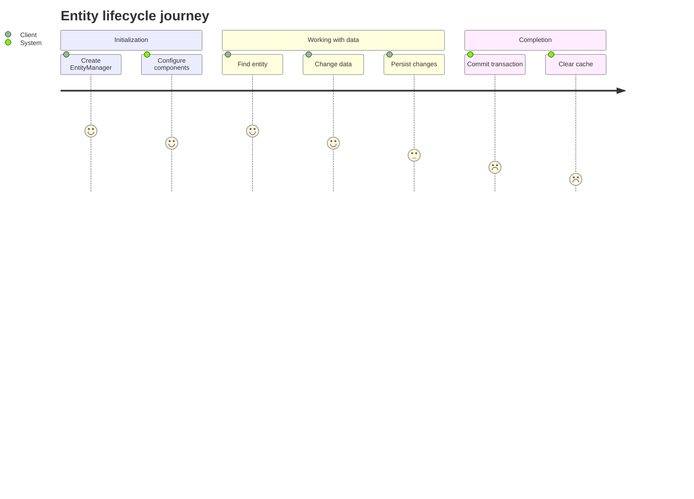
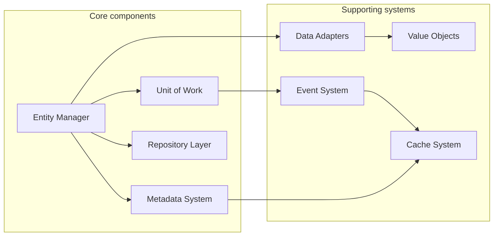

# Diagram index — Adaptive Entity Manager

Welcome to the Adaptive Entity Manager architecture diagram collection. This page is the navigation hub for all project diagrams.

## Project overview

Adaptive Entity Manager is a flexible PHP library for entity management across data sources. It supports adapters, Value Objects, and an event-driven entity lifecycle.

### Key features

- **Adaptive data sources** through the adapter system
- **Value Objects** with automatic conversion
- **Event system** for the entity lifecycle
- **Layered caching** for performance
- **Unit of Work** for change tracking
- **Extensibility** via interfaces and factories

## Diagram collection

### 1. [Architecture diagrams](./ARCHITECTURE_DIAGRAMS.md)

**High-level system and component overview**

```mermaid
mindmap
  root((Architecture))
    Core Layer
      AdaptiveEntityManager
      UnitOfWork
      Config
    Persistence Layer
      EntityPersister
      DataAdapters
      TransactionalConnection
    Metadata System
      ClassMetadataFactory
      ClassMetadataProvider
      ClassMetadata
    Value Objects
      ValueObjectInterface
      ValueObjectConverter
      ValueObjectRegistry
    Events & Caching
      EventDispatcher
      CacheSystem
```

**Includes:**

- Overall system architecture
- Entity Manager and how it collaborates with other parts
- Unit of Work pattern
- Data adapter system
- Value Object system
- Event system and lifecycle
- Metadata system

### 2. [Interaction diagrams](./INTERACTION_DIAGRAMS.md)

**Detailed flows and component interactions**

```mermaid
journey
    title Entity lifecycle journey
    section Initialization
      Create EntityManager: 5: Client
      Configure components: 4: System
    section Working with data
      Find entity: 5: Client
      Change data: 4: Client
      Persist changes: 3: Client
    section Completion
      Commit transaction: 2: System
      Clear cache: 1: System
```

**Includes:**

- Entity Manager initialization
- Entity lifecycle
- Query execution flow
- Commit (`flush`) flow
- Value Object conversion flow
- Caching strategy
- Error handling and exception flow

### 3. [Class diagrams](./CLASS_DIAGRAMS.md)

**UML-style class structure and relationships**

```mermaid
graph LR
    subgraph coreComponents [Core components]
        A[Entity Manager] --> B[Unit of Work]
        A --> C[Metadata System]
        A --> D[Repository Layer]
    end

    subgraph supportingSystems [Supporting systems]
        E[Data Adapters] --> F[Value Objects]
        G[Event System] --> H[Cache System]
    end

    A --> E
    B --> G
    C --> H
```

**Includes:**

- Core Entity Manager classes
- Metadata system classes
- Data adapter classes
- Persistence layer classes
- Value Object classes
- Repository classes
- Event system classes
- Cache classes
- Factory classes
- Exception classes

## Navigation map

### For developers new to the project

1. Start with [architecture diagrams](./ARCHITECTURE_DIAGRAMS.md) for the big picture.
2. Read [class diagrams](./CLASS_DIAGRAMS.md) for the object model.
3. Review [interaction diagrams](./INTERACTION_DIAGRAMS.md) for runtime behavior.

### For architects and tech leads

1. [Architecture diagrams](./ARCHITECTURE_DIAGRAMS.md) — system view
2. [Interaction diagrams](./INTERACTION_DIAGRAMS.md) — implementation detail
3. [Class diagrams](./CLASS_DIAGRAMS.md) — code structure

### For DevOps and operators

1. Caching and performance → [Architecture diagrams](./ARCHITECTURE_DIAGRAMS.md)
2. Error handling → [Interaction diagrams](./INTERACTION_DIAGRAMS.md)
3. Configuration → [Class diagrams](./CLASS_DIAGRAMS.md)

## Quick diagram lookup

| Topic | File | Diagram |
|------|------|---------|
| Overall architecture | [ARCHITECTURE_DIAGRAMS.md](./ARCHITECTURE_DIAGRAMS.md) | #1 |
| Unit of Work | [ARCHITECTURE_DIAGRAMS.md](./ARCHITECTURE_DIAGRAMS.md) | #3 |
| Data adapters | [ARCHITECTURE_DIAGRAMS.md](./ARCHITECTURE_DIAGRAMS.md) | #4 |
| Value Objects | [ARCHITECTURE_DIAGRAMS.md](./ARCHITECTURE_DIAGRAMS.md) | #5 |
| Events | [ARCHITECTURE_DIAGRAMS.md](./ARCHITECTURE_DIAGRAMS.md) | #6 |
| Initialization | [INTERACTION_DIAGRAMS.md](./INTERACTION_DIAGRAMS.md) | #1 |
| Lifecycle | [INTERACTION_DIAGRAMS.md](./INTERACTION_DIAGRAMS.md) | #2 |
| Query execution | [INTERACTION_DIAGRAMS.md](./INTERACTION_DIAGRAMS.md) | #3 |
| Commit flow | [INTERACTION_DIAGRAMS.md](./INTERACTION_DIAGRAMS.md) | #4 |
| Caching | [INTERACTION_DIAGRAMS.md](./INTERACTION_DIAGRAMS.md) | #6 |
| Error handling | [INTERACTION_DIAGRAMS.md](./INTERACTION_DIAGRAMS.md) | #7 |
| Core classes | [CLASS_DIAGRAMS.md](./CLASS_DIAGRAMS.md) | #1 |
| Metadata system | [CLASS_DIAGRAMS.md](./CLASS_DIAGRAMS.md) | #2 |
| Persistence | [CLASS_DIAGRAMS.md](./CLASS_DIAGRAMS.md) | #4 |
| Repositories | [CLASS_DIAGRAMS.md](./CLASS_DIAGRAMS.md) | #6 |

## Symbol legend

| Symbol | Meaning |
|--------|---------|
| 🏗️ | Architecture and structure |
| 🔄 | Processes and cycles |
| 💾 | Persistence and storage |
| 🔍 | Search and queries |
| 📡 | Events and messaging |
| 🗃️ | Caching and optimization |
| ⚠️ | Error handling |
| 🔧 | Configuration and setup |
| 💎 | Value Objects |
| 📦 | Components and modules |

## Next steps

After reviewing the diagrams:

1. **Explore examples** in the `examples/` directory (if present).
2. **Read tests** in `tests/` for usage patterns.
3. **Read** `VALUE_OBJECTS.md`, `CACHING.md`, and `TESTING.md`.
4. **Browse** source under `src/` for core classes.

## Feedback

Open an issue in the project repository for questions or diagram improvements.

---

*Diagrams use Mermaid for readability on GitHub and GitLab.*
