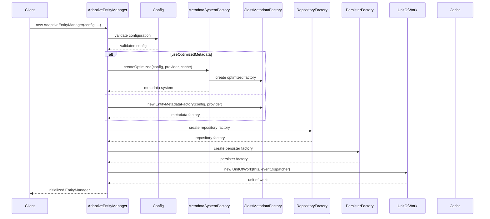
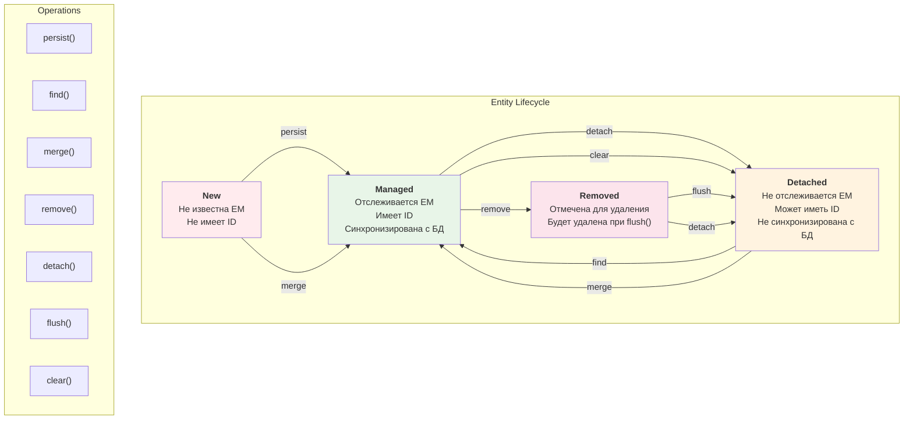
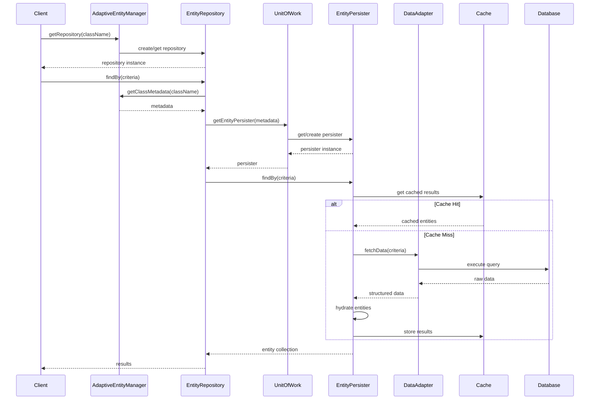
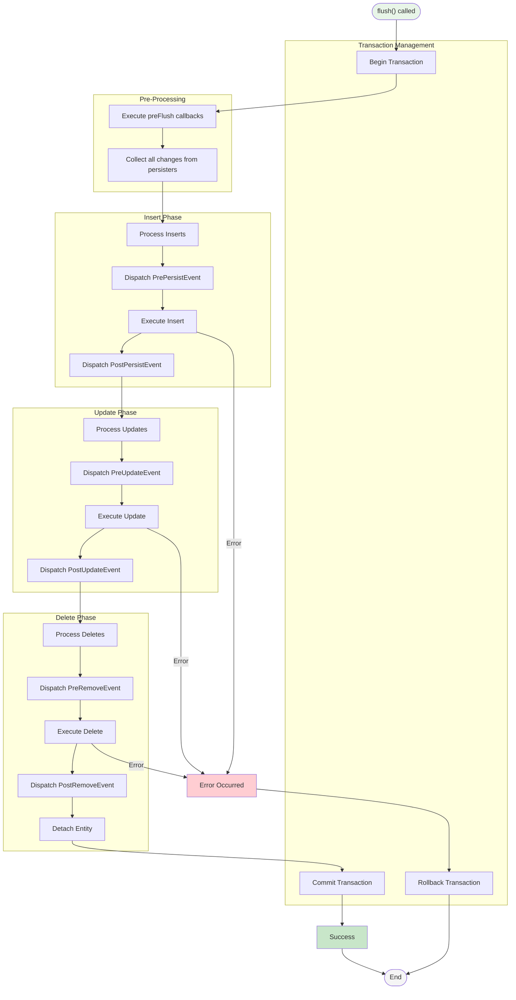
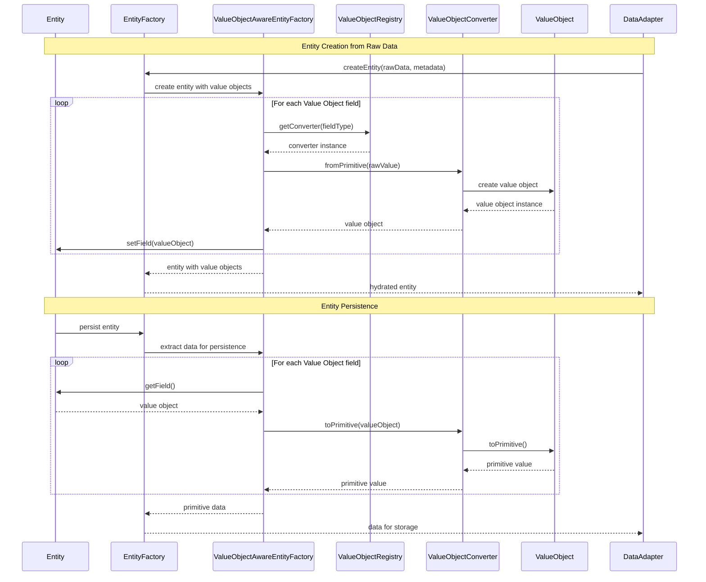
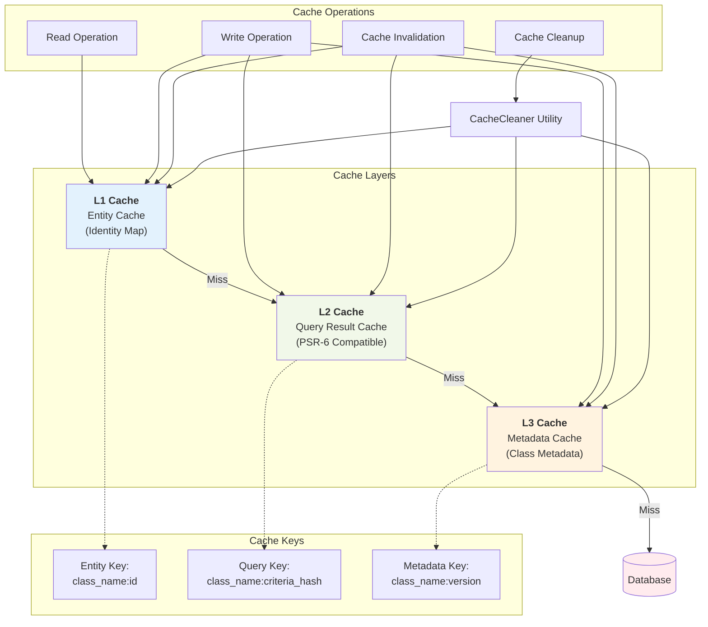
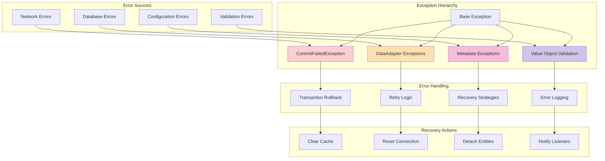

# Диаграммы взаимодействий и процессов

Этот документ содержит детальные диаграммы взаимодействий компонентов Adaptive Entity Manager.

## 1. Процесс инициализации Entity Manager

## 2. Жизненный цикл сущности

## 3. Процесс выполнения запроса

## 4. Процесс коммита (flush)

## 5. Value Object Conversion Flow

## 6. Caching Strategy

## 7. Error Handling и Exception Flow

## Заключение

Эти диаграммы показывают детальные взаимодействия компонентов Adaptive Entity Manager:

- **Инициализация**: Пошаговый процесс создания и настройки EntityManager
- **Жизненный цикл**: Состояния сущностей и переходы между ними
- **Запросы**: Полный цикл выполнения запросов с кешированием
- **Коммит**: Транзакционный процесс сохранения изменений
- **Value Objects**: Автоматическая конвертация между примитивами и объектами
- **Кеширование**: Многоуровневая стратегия кеширования
- **Обработка ошибок**: Комплексная система обработки исключений

Эта архитектура обеспечивает надежность, производительность и расширяемость ORM системы. 