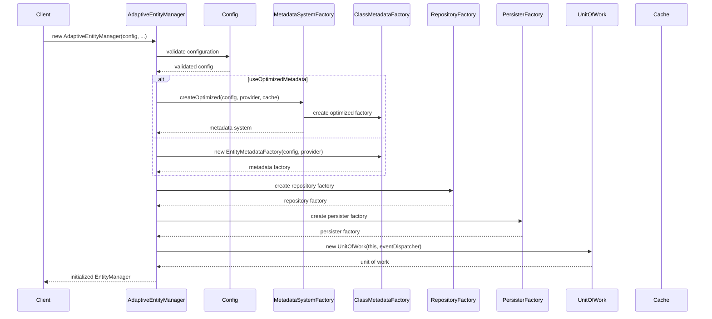
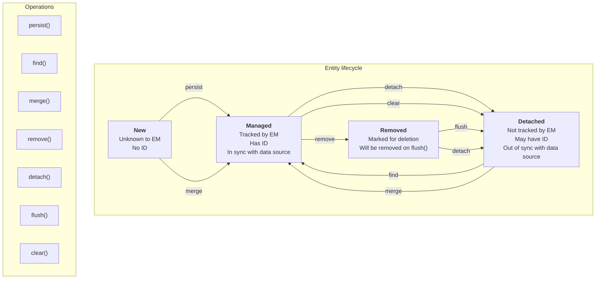
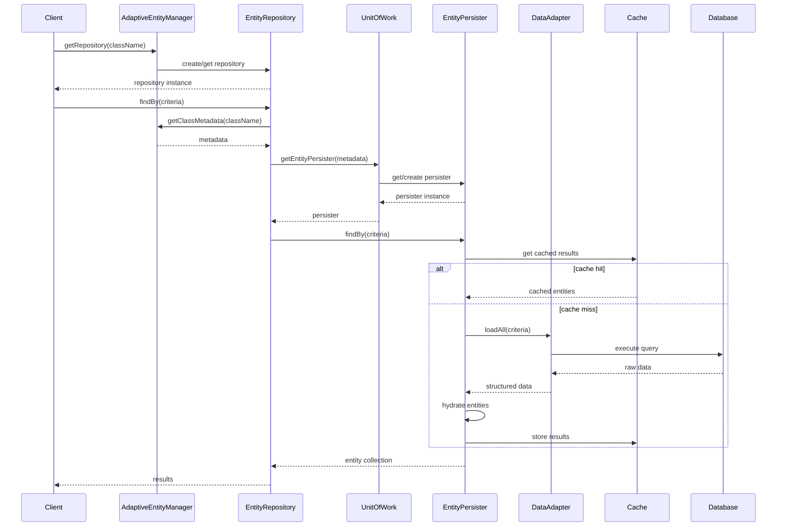
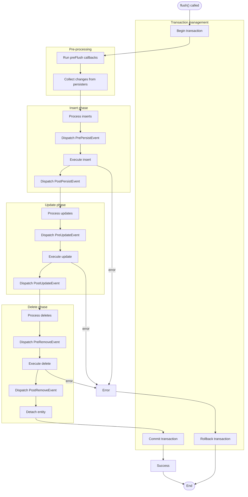
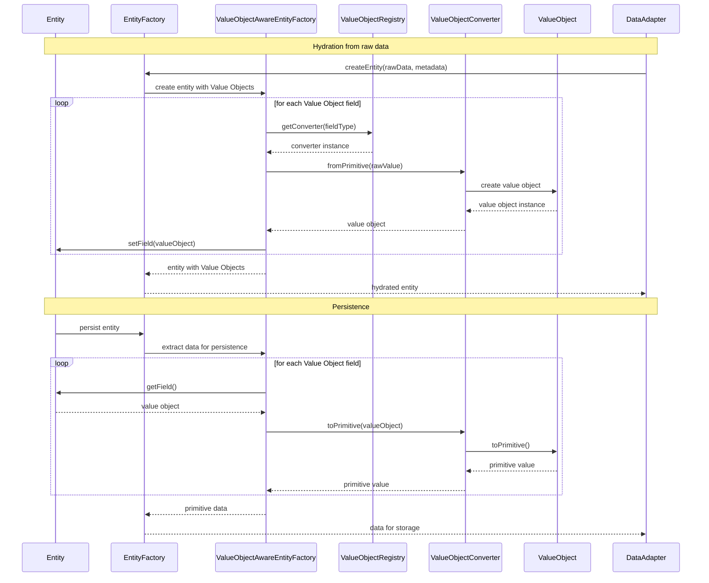
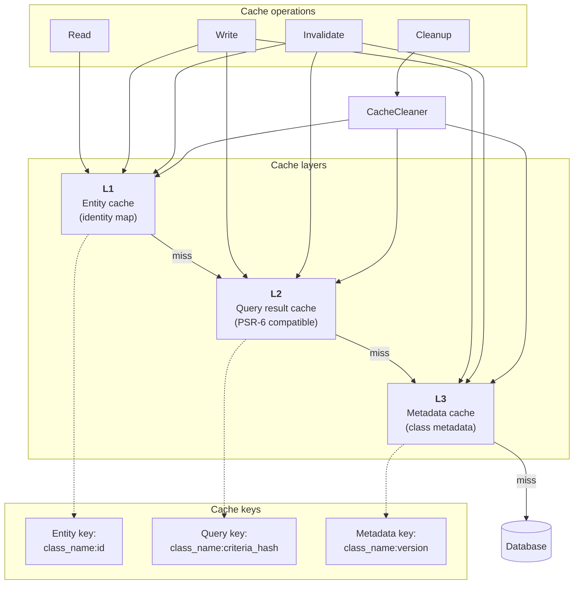
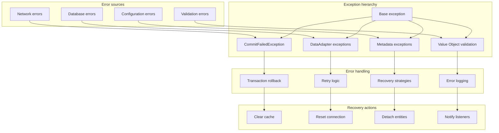

# Interaction and process diagrams

Detailed interaction diagrams for Adaptive Entity Manager components.

## 1. Entity Manager initialization

```mermaid
sequenceDiagram
    participant Client
    participant AEM as AdaptiveEntityManager
    participant Config
    participant MSF as MetadataSystemFactory
    participant CMF as ClassMetadataFactory
    participant RF as RepositoryFactory
    participant PF as PersisterFactory
    participant UOW as UnitOfWork
    participant Cache

    Client->>AEM: new AdaptiveEntityManager(config, ...)
    AEM->>Config: validate configuration
    Config-->>AEM: validated config

    alt useOptimizedMetadata
        AEM->>MSF: createOptimized(config, provider, cache)
        MSF->>CMF: create optimized factory
        MSF-->>AEM: metadata system
    else
        AEM->>CMF: new EntityMetadataFactory(config, provider)
        CMF-->>AEM: metadata factory
    end

    AEM->>RF: create repository factory
    RF-->>AEM: repository factory

    AEM->>PF: create persister factory
    PF-->>AEM: persister factory

    AEM->>UOW: new UnitOfWork(this, eventDispatcher)
    UOW-->>AEM: unit of work

    AEM-->>Client: initialized EntityManager
```

## 2. Entity lifecycle

```mermaid
graph TB
    subgraph entityLifecycle [Entity lifecycle]
        New["`**New**
        Unknown to EM
        No ID`"]

        Managed["`**Managed**
        Tracked by EM
        Has ID
        In sync with data source`"]

        Detached["`**Detached**
        Not tracked by EM
        May have ID
        Out of sync with data source`"]

        Removed["`**Removed**
        Marked for deletion
        Will be removed on flush()`"]
    end

    subgraph operations [Operations]
        persist["`persist()`"]
        find["`find()`"]
        merge["`merge()`"]
        remove["`remove()`"]
        detach["`detach()`"]
        flush["`flush()`"]
        clear["`clear()`"]
    end

    New -->|persist| Managed
    New -->|merge| Managed
    Detached -->|find| Managed
    Detached -->|merge| Managed
    Managed -->|remove| Removed
    Managed -->|detach| Detached
    Managed -->|clear| Detached
    Removed -->|flush| Detached
    Removed -->|detach| Detached
```

## 3. Query execution flow

```mermaid
sequenceDiagram
    participant Client
    participant AEM as AdaptiveEntityManager
    participant Repo as EntityRepository
    participant UOW as UnitOfWork
    participant EP as EntityPersister
    participant DA as DataAdapter
    participant Cache
    participant DB as Database

    Client->>AEM: getRepository(className)
    AEM->>Repo: create/get repository
    Repo-->>Client: repository instance

    Client->>Repo: findBy(criteria)
    Repo->>AEM: getClassMetadata(className)
    AEM-->>Repo: metadata

    Repo->>UOW: getEntityPersister(metadata)
    UOW->>EP: get/create persister
    EP-->>UOW: persister instance
    UOW-->>Repo: persister

    Repo->>EP: findBy(criteria)

    EP->>Cache: get cached results
    alt cache hit
        Cache-->>EP: cached entities
    else cache miss
        EP->>DA: loadAll(criteria)
        DA->>DB: execute query
        DB-->>DA: raw data
        DA-->>EP: structured data
        EP->>EP: hydrate entities
        EP->>Cache: store results
    end

    EP-->>Repo: entity collection
    Repo-->>Client: results
```

## 4. Commit (flush) flow

```mermaid
flowchart TB
    Start(["`flush() called`"])

    subgraph transactionMgmt [Transaction management]
        BeginTx["`Begin transaction`"]
        CommitTx["`Commit transaction`"]
        RollbackTx["`Rollback transaction`"]
    end

    subgraph preProcessing [Pre-processing]
        PreFlush["`Run preFlush callbacks`"]
        CollectChanges["`Collect changes from persisters`"]
    end

    subgraph insertPhase [Insert phase]
        ProcessInserts["`Process inserts`"]
        PrePersistEvent["`Dispatch PrePersistEvent`"]
        ExecuteInsert["`Execute insert`"]
        PostPersistEvent["`Dispatch PostPersistEvent`"]
    end

    subgraph updatePhase [Update phase]
        ProcessUpdates["`Process updates`"]
        PreUpdateEvent["`Dispatch PreUpdateEvent`"]
        ExecuteUpdate["`Execute update`"]
        PostUpdateEvent["`Dispatch PostUpdateEvent`"]
    end

    subgraph deletePhase [Delete phase]
        ProcessDeletes["`Process deletes`"]
        PreRemoveEvent["`Dispatch PreRemoveEvent`"]
        ExecuteDelete["`Execute delete`"]
        PostRemoveEvent["`Dispatch PostRemoveEvent`"]
        DetachEntity["`Detach entity`"]
    end

    Error["`Error`"]
    Success["`Success`"]
    End(["`End`"])

    Start --> BeginTx
    BeginTx --> PreFlush
    PreFlush --> CollectChanges
    CollectChanges --> ProcessInserts

    ProcessInserts --> PrePersistEvent
    PrePersistEvent --> ExecuteInsert
    ExecuteInsert --> PostPersistEvent
    PostPersistEvent --> ProcessUpdates

    ProcessUpdates --> PreUpdateEvent
    PreUpdateEvent --> ExecuteUpdate
    ExecuteUpdate --> PostUpdateEvent
    PostUpdateEvent --> ProcessDeletes

    ProcessDeletes --> PreRemoveEvent
    PreRemoveEvent --> ExecuteDelete
    ExecuteDelete --> PostRemoveEvent
    PostRemoveEvent --> DetachEntity
    DetachEntity --> CommitTx

    CommitTx --> Success
    Success --> End

    ExecuteInsert -->|error| Error
    ExecuteUpdate -->|error| Error
    ExecuteDelete -->|error| Error
    Error --> RollbackTx
    RollbackTx --> End
```

## 5. Value Object conversion flow

```mermaid
sequenceDiagram
    participant Entity
    participant EF as EntityFactory
    participant VOAEF as ValueObjectAwareEntityFactory
    participant VOR as ValueObjectRegistry
    participant VOC as ValueObjectConverter
    participant VO as ValueObject
    participant DA as DataAdapter

    Note over Entity,DA: Hydration from raw data

    DA->>EF: createEntity(rawData, metadata)
    EF->>VOAEF: create entity with Value Objects

    loop for each Value Object field
        VOAEF->>VOR: getConverter(fieldType)
        VOR-->>VOAEF: converter instance

        VOAEF->>VOC: fromPrimitive(rawValue)
        VOC->>VO: create value object
        VO-->>VOC: value object instance
        VOC-->>VOAEF: value object

        VOAEF->>Entity: setField(valueObject)
    end

    VOAEF-->>EF: entity with Value Objects
    EF-->>DA: hydrated entity

    Note over Entity,DA: Persistence

    Entity->>EF: persist entity
    EF->>VOAEF: extract data for persistence

    loop for each Value Object field
        VOAEF->>Entity: getField()
        Entity-->>VOAEF: value object

        VOAEF->>VOC: toPrimitive(valueObject)
        VOC->>VO: toPrimitive()
        VO-->>VOC: primitive value
        VOC-->>VOAEF: primitive value
    end

    VOAEF-->>EF: primitive data
    EF-->>DA: data for storage
```

## 6. Caching strategy

```mermaid
graph TB
    subgraph cacheLayers [Cache layers]
        L1["`**L1**
        Entity cache
        (identity map)`"]

        L2["`**L2**
        Query result cache
        (PSR-6 compatible)`"]

        L3["`**L3**
        Metadata cache
        (class metadata)`"]
    end

    subgraph cacheOps [Cache operations]
        Read["`Read`"]
        Write["`Write`"]
        Invalidate["`Invalidate`"]
        Cleanup["`Cleanup`"]
    end

    subgraph cacheKeys [Cache keys]
        EntityKey["`Entity key:
        class_name:id`"]

        QueryKey["`Query key:
        class_name:criteria_hash`"]

        MetadataKey["`Metadata key:
        class_name:version`"]
    end

    Read --> L1
    L1 -->|miss| L2
    L2 -->|miss| L3
    L3 -->|miss| Database[(Database)]

    Write --> L1
    Write --> L2
    Write --> L3

    Invalidate --> L1
    Invalidate --> L2
    Invalidate --> L3

    Cleanup --> CacheCleaner["`CacheCleaner`"]
    CacheCleaner --> L1
    CacheCleaner --> L2
    CacheCleaner --> L3

    L1 -.-> EntityKey
    L2 -.-> QueryKey
    L3 -.-> MetadataKey
```

## 7. Error handling and exception flow

```mermaid
graph TB
    subgraph exceptionHierarchy [Exception hierarchy]
        BaseEx["`Base exception`"]
        CommitEx["`CommitFailedException`"]
        DataEx["`DataAdapter exceptions`"]
        MetadataEx["`Metadata exceptions`"]
        ValidationEx["`Value Object validation`"]
    end

    subgraph errorSources [Error sources]
        DB["`Database errors`"]
        Network["`Network errors`"]
        Validation["`Validation errors`"]
        Config["`Configuration errors`"]
    end

    subgraph errorHandling [Error handling]
        Rollback["`Transaction rollback`"]
        Retry["`Retry logic`"]
        Logging["`Error logging`"]
        Recovery["`Recovery strategies`"]
    end

    subgraph recoveryActions [Recovery actions]
        ClearCache["`Clear cache`"]
        ResetConnection["`Reset connection`"]
        Detach["`Detach entities`"]
        Notify["`Notify listeners`"]
    end

    DB --> DataEx
    Network --> CommitEx
    Validation --> ValidationEx
    Config --> MetadataEx

    BaseEx --> CommitEx
    BaseEx --> DataEx
    BaseEx --> MetadataEx
    BaseEx --> ValidationEx

    CommitEx --> Rollback
    DataEx --> Retry
    MetadataEx --> Recovery
    ValidationEx --> Logging

    Rollback --> ClearCache
    Retry --> ResetConnection
    Recovery --> Detach
    Logging --> Notify
```

## Summary

These diagrams show how Adaptive Entity Manager behaves at runtime:

- **Initialization:** how `EntityManager` is constructed and wired
- **Lifecycle:** entity states and allowed transitions
- **Queries:** repository queries, optional caching, adapter access
- **Commit:** transactional flush with ordered operations
- **Value Objects:** primitive ↔ object conversion during hydration and persistence
- **Caching:** layered read/write and invalidation concepts
- **Errors:** where failures surface and typical responses

Together they illustrate a modular architecture focused on reliability, performance hooks, and extension points.
