# 🛣️ Roadmap миграции с Legacy на Doctrine

Этот документ описывает пошаговую стратегию миграции от монолитной legacy системы к современной архитектуре с Doctrine ORM через Adaptive Entity Manager.

## 📊 Временная линия миграции

```mermaid
flowchart LR
    %% Этап 1: Legacy
    subgraph "📅 Legacy"
        L1["🏚️ Монолитное<br/>приложение"]
        L2["🗄️ Legacy DB"]
        L3["📝 Смешанный<br/>код"]
        L1 --> L2
        L2 --> L3
    end
    
    %% Этап 2: AEM
    subgraph "🔄 AEM Integration"
        A1["🏗️ Adaptive<br/>Entity Manager"]
        A2["🔌 Legacy DB<br/>Adapter"]
        A3["📦 Value<br/>Objects"]
        A1 --> A2
        A2 --> A3
    end
    
    %% Этап 3: Гибрид
    subgraph "🎯 Hybrid Architecture"
        M1["🏛️ Entity<br/>Manager"]
        M2["🔄 Multi<br/>Sources"]
        M3["🌐 APIs &<br/>Files"]
        M1 --> M2
        M2 --> M3
    end
    
    %% Этап 4: Финал
    subgraph "🏆 Final State"
        F1["🏛️ Doctrine<br/>ORM"]
        F2["🗄️ Unified<br/>Database"]
        F3["🚀 Production<br/>Ready"]
        F1 --> F2
        F2 --> F3
    end
    
    %% Horizontal flow between stages
    L3 -.->|"Integrate"| A1
    A3 -.->|"Expand"| M1
    M3 -.->|"Migrate"| F1
    
    %% Styling
    classDef legacyStyle fill:#ffcdd2,stroke:#d32f2f,stroke-width:2px,color:#000
    classDef aemStyle fill:#e3f2fd,stroke:#1976d2,stroke-width:2px,color:#000
    classDef hybridStyle fill:#fff3e0,stroke:#f57c00,stroke-width:2px,color:#000
    classDef finalStyle fill:#e8f5e8,stroke:#388e3c,stroke-width:2px,color:#000
    
    class L1,L2,L3 legacyStyle
    class A1,A2,A3 aemStyle
    class M1,M2,M3 hybridStyle
    class F1,F2,F3 finalStyle
```



## 🔍 Детальный разбор этапов

### 📅 Этап 1: Legacy State (Текущее состояние)
*Время: 0-2 недели (анализ и планирование)*

#### 🏚️ Что имеем:
- **Монолитное приложение** - все в одном большом проекте
- **Legacy Database** - старая схема БД с "интересными" решениями
- **Смешанный код** - SQL запросы вперемешку с бизнес-логикой

#### 😰 Типичные проблемы:
- Страшно что-то менять - все завязано на все
- Тесты? Какие тесты? 
- Документация существует только в головах ветеранов
- "Работает - не трогай!" (но работает через раз)

#### 🎯 Задачи этапа:
```php
// Анализируем текущий код
$legacy = new LegacyAnalyzer();
$tables = $legacy->analyzeDatabaseSchema();
$dependencies = $legacy->findCodeDependencies();
$pain_points = $legacy->identifyPainPoints(); // Их будет много 😅
```

**Мой совет**: Не пытайтесь сразу переписать все! Сначала поймите, что у вас есть. Создайте карту зависимостей. Найдите самые болезненные места.

---

### 🔄 Этап 2: AEM Integration (Внедрение Adaptive Entity Manager)
*Время: 2-4 недели (в зависимости от размера legacy)*

#### 🏗️ Что делаем:
- **Подключаем AEM** к существующей legacy БД
- **Создаем Legacy DB Adapter** - мост между старым и новым
- **Внедряем Value Objects** - приводим данные к человеческому виду

#### 💡 Магия происходит здесь:
```php
// Вместо этого ужаса:
$result = mysql_query("SELECT user_id, user_email, user_balance FROM users WHERE user_id = $id");
$user_data = mysql_fetch_assoc($result);
$email = $user_data['user_email']; // А что если null?
$balance = $user_data['user_balance']; // В копейках? В рублях?

// Получаем это:
$user = $userRepository->find($id);
$email = $user->getEmail(); // Email Value Object с валидацией
$balance = $user->getBalance(); // Money Value Object с валютой
```

#### 🚀 Преимущества AEM на этом этапе:
- **Быстрый старт** - за день можно подключить к любой legacy БД
- **Постепенность** - не нужно переписывать все сразу
- **Безопасность** - старый код продолжает работать
- **Value Objects** - данные становятся типизированными и безопасными

#### ⚠️ Подводные камни:
- Соблазн сразу переписать весь код (не поддавайтесь!)
- Legacy схема БД может быть... творческой
- Команда может сопротивляться изменениям

**Мой совет**: Начните с одного модуля. Покажите результат. Пусть команда увидит, как становится проще работать. Успех породит желание продолжать!

---

### 🎯 Этап 3: Hybrid Architecture (Гибридная архитектура)
*Время: 1-3 месяца (самый интересный этап)*

#### 🏛️ Что происходит:
- **Entity Manager** становится центральным хабом
- **Multi Sources** - подключаем разные источники данных
- **APIs & Files** - выносим части системы в отдельные сервисы

#### 🎪 Цирк с конями начинается:
```php
// Теперь у нас может быть такое:
$userRepository = $em->getRepository(User::class);
$user = $userRepository->find($userId); // Из legacy БД

$profileRepository = $em->getRepository(UserProfile::class);  
$profile = $profileRepository->find($userId); // Из нового API

$documentsRepository = $em->getRepository(Document::class);
$documents = $documentsRepository->findByUser($userId); // Из файловой системы

// И все это работает как единое целое!
```

#### 🌟 Магия гибридной архитектуры:
- **Одновременно** работаем со старой БД и новыми API
- **Постепенно** выносим части в микросервисы
- **Прозрачно** для бизнес-логики - она не знает, откуда данные
- **Безопасно** - можем откатиться на любом этапе

#### 🏗️ Примеры адаптеров:
```php
// Legacy БД адаптер
class LegacyDatabaseAdapter extends AbstractDataAdapter {
    public function fetchData($criteria) {
        // Работаем со старой БД
        return $this->legacyConnection->query($sql);
    }
}

// REST API адаптер  
class RestApiAdapter extends AbstractDataAdapter {
    public function fetchData($criteria) {
        // Ходим в новый API
        return $this->httpClient->get('/api/users/' . $criteria['id']);
    }
}

// Файловый адаптер
class FileSystemAdapter extends AbstractDataAdapter {
    public function fetchData($criteria) {
        // Читаем из файлов
        return json_decode(file_get_contents($this->dataPath . '/' . $criteria['id'] . '.json'));
    }
}
```

#### 😅 Проблемы этого этапа:
- **Сложность отладки** - данные могут быть в 5 разных местах
- **Производительность** - N+1 проблемы в квадрате
- **Консистентность** - транзакции становятся сложными
- **Мониторинг** - нужно следить за всеми источниками

**Мой совет**: Не спешите! Это самый ответственный этап. Хорошо продумайте, какие данные куда выносить. Начните с наименее критичных частей. Обязательно добавьте логирование и мониторинг!

---

### 🏆 Этап 4: Final State (Финальная архитектура)
*Время: 1-2 месяца (зависит от объема данных)*

#### 🏛️ Переход на Doctrine:
- **Doctrine ORM** - промышленная ORM для долгосрочного использования
- **Unified Database** - все данные в едином, нормализованном виде
- **Production Ready** - стабильная, поддерживаемая система

#### 🎯 Что получаем в итоге:
```php
// Вместо зоопарка адаптеров:
$user = $userApiAdapter->fetchUser($id);
$profile = $profileDbAdapter->fetchProfile($id);  
$orders = $orderFileAdapter->fetchOrders($id);

// Получаем красивый Doctrine код:
$user = $userRepository->find($id);
$profile = $user->getProfile(); // Lazy loading
$orders = $user->getOrders(); // Ассоциации

// DQL для сложных запросов:
$query = $em->createQuery('
    SELECT u, p, o FROM User u 
    JOIN u.profile p 
    JOIN u.orders o 
    WHERE u.isActive = true
');
```

#### 🚀 Преимущества финальной архитектуры:
- **Стандартность** - любой PHP разработчик знает Doctrine
- **Экосистема** - множество готовых решений и бандлов
- **Производительность** - оптимизированные запросы и кеширование
- **Поддержка** - активное сообщество и документация

#### 🎉 Что изменилось с начала пути:
```php
// Было (Legacy):
$sql = "SELECT * FROM users WHERE user_id = " . $id; // SQL injection привет!
$result = mysql_query($sql);
$user_data = mysql_fetch_assoc($result);
if ($user_data['user_email'] != '') { // А что если null?
    $email = $user_data['user_email'];
}

// Стало (Doctrine):
$user = $userRepository->find($id);
$email = $user->getEmail(); // Типизированный Email Value Object
// Никаких SQL injection, null checks, magic strings!
```

**Мой совет**: Не расслабляйтесь! Doctrine - это мощный инструмент, но с ним тоже нужно уметь работать. Изучите лучшие практики, настройте профилирование, добавьте тесты.

---

## 📈 Метрики прогресса

### Как понять, что идете в правильном направлении:

| Этап | Метрика | Хорошо | Плохо |
|------|---------|--------|-------|
| **Legacy** | Время на фикс бага | 2-3 дня | 1-2 недели |
| **AEM** | Покрытие тестами | 30%+ | <10% |
| **Hybrid** | Время деплоя | 30 минут | 3+ часа |
| **Final** | Время разработки фичи | 2-3 дня | 1-2 недели |

### 📊 KPI по этапам:
```php
// Можете даже автоматизировать:
class MigrationMetrics {
    public function calculateProgress(): array {
        return [
            'legacy_code_percentage' => $this->getLegacyCodePercentage(),
            'test_coverage' => $this->getTestCoverage(),
            'deployment_time' => $this->getAverageDeploymentTime(),
            'bug_fix_time' => $this->getAverageBugFixTime(),
            'developer_happiness' => $this->getDeveloperHappinessScore(), // 😊
        ];
    }
}
```

## 🎭 Реальные истории успеха

### История 1: E-commerce платформа
```
Было: 
- Монолит на 500к строк кода
- 300 таблиц в БД
- Деплой раз в месяц
- 3 дня на исправление бага

Стало:
- 15 микросервисов
- Каждый сервис со своей БД
- Деплой несколько раз в день
- Баги исправляются за часы
```

### История 2: CRM система
```
Было:
- Access БД (да, в 2020 году!)
- Excel отчеты
- Ручная синхронизация данных
- 1 программист, который всё знает

Стало:
- PostgreSQL
- Автоматическая аналитика
- REST API для интеграций
- Команда из 5 разработчиков
```

## 🚨 Когда что-то идет не так

### Красные флаги:
- 🔴 **Этап затягивается в 2+ раза** - пересмотрите план
- 🔴 **Команда сопротивляется** - нужна работа с людьми
- 🔴 **Производительность упала** - что-то не так с архитектурой
- 🔴 **Багов стало больше** - слишком быстро меняете код

### Что делать:
```php
if ($migration->isStuck()) {
    $migration->pause();
    $migration->analyzeProblems();
    $migration->adjustPlan();
    $migration->communicateWithTeam();
    $migration->resume();
}
```

## 💡 Лайфхаки от практика

### 1. Документируйте все изменения
```php
// Создайте ADR (Architecture Decision Records)
$adr = new ArchitectureDecisionRecord();
$adr->setTitle('Выбор стратегии миграции пользователей');
$adr->setContext('Legacy БД содержит 50 таблиц для пользователей');
$adr->setDecision('Используем AEM с постепенной миграцией');
$adr->setConsequences('Возможны временные проблемы с производительностью');
```

### 2. Автоматизируйте мониторинг
```php
// Следите за здоровьем системы
$healthCheck = new MigrationHealthCheck();
$healthCheck->checkLegacyDbConnection();
$healthCheck->checkApiAvailability();
$healthCheck->checkDataConsistency();
$healthCheck->sendAlerts();
```

### 3. Готовьте план отката
```php
// Всегда имейте план B
$rollbackPlan = new RollbackPlan();
$rollbackPlan->setRollbackWindow('2 hours');
$rollbackPlan->setDataBackupStrategy('Full backup before each stage');
$rollbackPlan->setRollbackTriggers(['Performance degradation > 50%', 'Error rate > 5%']);
```

## 🎯 Заключение

**Миграция - это не спринт, это марафон!** 

### Формула успеха:
```
Терпение + Планирование + Постепенность = Успешная миграция
```

### Помните:
- 🎯 **Цель** - не переписать код, а улучшить жизнь
- 🔄 **Процесс** важнее скорости
- 👥 **Команда** должна быть на борту
- 📊 **Метрики** помогают не заблудиться
- 🛡️ **Безопасность** превыше всего

### И самое главное:
> *"Код пишется один раз, а читается тысячи. Сделайте так, чтобы через год вы сами могли понять, что здесь происходит!"* 

---

**Удачи в миграции! Пусть ваш legacy код превратится в красивую современную архитектуру! 🚀**

*P.S. Если что-то пошло не так - не паникуйте. В программировании нет проблем, есть только интересные задачи! 😄* 