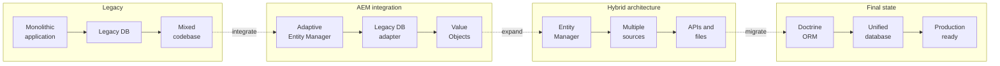

# Migration roadmap: from legacy to Doctrine

A step-by-step strategy for moving from a monolithic legacy system toward a modern Doctrine ORM architecture using Adaptive Entity Manager as a bridge.

## Migration timeline


```mermaid
flowchart LR
    subgraph legacyStage [Legacy]
        L1["Monolithic<br/>application"]
        L2["Legacy DB"]
        L3["Mixed<br/>codebase"]
        L1 --> L2
        L2 --> L3
    end

    subgraph aemStage [AEM integration]
        A1["Adaptive<br/>Entity Manager"]
        A2["Legacy DB<br/>adapter"]
        A3["Value<br/>Objects"]
        A1 --> A2
        A2 --> A3
    end

    subgraph hybridStage [Hybrid architecture]
        M1["Entity<br/>Manager"]
        M2["Multiple<br/>sources"]
        M3["APIs and<br/>files"]
        M1 --> M2
        M2 --> M3
    end

    subgraph finalStage [Final state]
        F1["Doctrine<br/>ORM"]
        F2["Unified<br/>database"]
        F3["Production<br/>ready"]
        F1 --> F2
        F2 --> F3
    end

    L3 -.->|integrate| A1
    A3 -.->|expand| M1
    M3 -.->|migrate| F1
```

## Stages in detail

### Stage 1: Legacy state

*Typical duration: 0–2 weeks (analysis and planning)*

#### What you usually have

- **Monolithic application** — one large codebase
- **Legacy database** — schemas full of “interesting” past decisions
- **Mixed code** — SQL scattered through business logic

#### Common pain points

- Fear of change because everything depends on everything
- Little or no automated tests
- Documentation lives in people’s heads
- “Do not touch it” culture (and it still breaks sometimes)

#### Goals for this stage

```php
// Understand what you have today
$legacy = new LegacyAnalyzer();
$tables = $legacy->analyzeDatabaseSchema();
$dependencies = $legacy->findCodeDependencies();
$pain_points = $legacy->identifyPainPoints(); // expect a long list
```

**Practical advice:** do not rewrite everything at once. Map dependencies, inventory schemas, and name the riskiest hotspots first.

---

### Stage 2: AEM integration

*Typical duration: 2–4 weeks depending on legacy size*

#### What you do

- **Wire AEM** to the existing legacy database
- **Build a legacy DB adapter** that translates old storage into entity operations
- **Introduce Value Objects** so primitives gain validation and meaning

#### Why it matters

```php
// Instead of unstructured arrays:
$result = mysql_query("SELECT user_id, user_email, user_balance FROM users WHERE user_id = $id");
$user_data = mysql_fetch_assoc($result);
$email = $user_data['user_email']; // nullable? valid?
$balance = $user_data['user_balance']; // cents? currency?

// You move toward typed access:
$user = $userRepository->find($id);
$email = $user->getEmail(); // Email Value Object
$balance = $user->getBalance(); // Money Value Object
```

#### AEM strengths here

- **Fast integration** with a legacy database in days, not months
- **Incremental rollout** — one bounded context at a time
- **Low blast radius** — old paths can keep running in parallel
- **Richer data model** via Value Objects

#### Things to watch

- Temptation to rewrite everything immediately
- Creative legacy schemas that fight elegant mapping
- Team skepticism without a visible win

**Practical advice:** pick one module, prove the pattern, let the team feel the difference. Momentum beats big-bang plans.

---

### Stage 3: Hybrid architecture

*Typical duration: 1–3 months — often the noisiest phase*

#### What changes

- **Entity Manager** becomes the coordination point
- **Multiple sources** coexist: old DB, new APIs, files, queues
- **Services split out** while the UX stays stable

#### Example shape

```php
$userRepository = $em->getRepository(User::class);
$user = $userRepository->find($userId); // legacy DB

$profileRepository = $em->getRepository(UserProfile::class);
$profile = $profileRepository->find($userId); // modern API

$documentsRepository = $em->getRepository(Document::class);
$documents = $documentsRepository->findByUser($userId); // filesystem or object storage

// Application code can stay similar even though storage differs.
```

#### Why hybrid helps

- Old and new systems run side by side
- Extract bounded contexts without freezing product work
- Business rules stop caring which adapter answered the call
- Roll back individual slices if something misbehaves

#### Adapter sketches

```php
// Legacy DB adapter (sketch — implement EntityDataAdapter methods)
class LegacyDatabaseAdapter extends AbstractDataAdapter {
    public function loadById(array $identifier): ?array {
        return $this->legacyConnection->query(/* build SQL from $identifier */);
    }

    public function loadAll(array $criteria = [], ?array $orderBy = null, ?int $limit = null, ?int $offset = null): array {
        return $this->legacyConnection->queryAll(/* ... */);
    }

    public function insert(array $row): array { /* ... */ }
    public function update(array $identifier, array $row): void { /* ... */ }
    public function delete(array $identifier): void { /* ... */ }
    public function refresh(array $identifier): array { /* ... */ }
}

// REST API adapter
class RestApiAdapter extends AbstractDataAdapter {
    public function loadById(array $identifier): ?array {
        return $this->httpClient->get('/api/users/' . $identifier['id']);
    }
    // insert, update, delete, refresh, loadAll ...
}

// Filesystem-backed adapter
class FileSystemAdapter extends AbstractDataAdapter {
    public function loadById(array $identifier): ?array {
        $path = $this->dataPath . '/' . $identifier['id'] . '.json';
        return file_exists($path) ? json_decode(file_get_contents($path), true) : null;
    }
    // insert, update, delete, refresh, loadAll ...
}
```

#### Hybrid risks

- **Debugging complexity** — data may live in many physical systems
- **Performance** — amplified N+1 patterns if fetch plans are naive
- **Consistency** — distributed transactions rarely come for free
- **Observability** — every source needs health checks

**Practical advice:** move low-risk data first, invest in logging and tracing, and design rollback paths before flipping traffic.

---

### Stage 4: Final Doctrine state

*Typical duration: 1–2 months depending on data volume*

#### Target outcome

- **Doctrine ORM** for the relational core you will run long term
- **Unified database** once ownership and schemas stabilize
- **Production practices** — profiling, migrations, predictable deploys

#### End state example

```php
// Instead of many unrelated integration entry points:
$user = $userIntegration->getById($id);
$profile = $profileIntegration->findForUser($id);
$orders = $ordersIntegration->listForUser($id);

// You converge on Doctrine semantics:
$user = $userRepository->find($id);
$profile = $user->getProfile();
$orders = $user->getOrders();

// Complex reads via DQL when appropriate:
$query = $em->createQuery('
    SELECT u, p, o FROM User u
    JOIN u.profile p
    JOIN u.orders o
    WHERE u.isActive = true
');
```

#### Why the finish line feels better

- Familiar tooling for most PHP teams
- Ecosystem extras: migrations, bundles, community recipes
- Mature performance tooling once mappings are clean
- Ongoing documentation and support

#### Mindset shift

```php
// Legacy style:
$sql = "SELECT * FROM users WHERE user_id = " . $id;
$result = mysql_query($sql);
$user_data = mysql_fetch_assoc($result);

// Doctrine style:
$user = $userRepository->find($id);
$email = $user->getEmail();
```

**Practical advice:** Doctrine is powerful — budget time for training, profiling, and automated tests around critical mappings.

---

## Progress signals

### How to know you are moving forward

| Stage | Signal | Healthy | Concerning |
|-------|--------|---------|------------|
| Legacy | Time to fix typical bugs | 2–3 days | 1–2 weeks |
| AEM | Automated test coverage | 30%+ | under 10% |
| Hybrid | Deploy duration | ~30 minutes | 3+ hours |
| Final | Time for medium feature | 2–3 days | 1–2 weeks |

### Optional metrics helper

```php
class MigrationMetrics {
    public function calculateProgress(): array {
        return [
            'legacy_code_percentage' => $this->getLegacyCodePercentage(),
            'test_coverage' => $this->getTestCoverage(),
            'deployment_time' => $this->getAverageDeploymentTime(),
            'bug_fix_time' => $this->getAverageBugFixTime(),
            'developer_happiness' => $this->getDeveloperHappinessScore(),
        ];
    }
}
```

## Example outcomes

### Story 1: E-commerce platform

```
Before:
- ~500k LOC monolith
- ~300 tables
- Monthly deploys
- Multi-day bug fixes

After:
- Service boundaries with focused databases
- Deploys multiple times per day
- Incidents traced and fixed in hours
```

### Story 2: CRM modernization

```
Before:
- Desktop-era data stores
- Manual spreadsheet reporting
- One hero maintainer

After:
- PostgreSQL core
- Automated analytics pipelines
- REST APIs for integrations
- Larger, onboardable team
```

## When things go wrong

### Red flags

- A stage takes **more than double** the planned time
- **Team resistance** grows instead of shrinking
- **Latency or throughput** regresses without a mitigation plan
- **Defect rate climbs** right after large mechanical changes

### Response loop

```php
if ($migration->isStuck()) {
    $migration->pause();
    $migration->analyzeProblems();
    $migration->adjustPlan();
    $migration->communicateWithTeam();
    $migration->resume();
}
```

## Practitioner tips

### 1. Record decisions

```php
// Architecture Decision Records keep context durable
$adr = new ArchitectureDecisionRecord();
$adr->setTitle('User-domain migration strategy');
$adr->setContext('Legacy split across dozens of user-related tables');
$adr->setDecision('Adopt AEM first, then Doctrine per bounded context');
$adr->setConsequences('Temporary dual-write paths until cutover completes');
```

### 2. Automate health checks

```php
$healthCheck = new MigrationHealthCheck();
$healthCheck->checkLegacyDbConnection();
$healthCheck->checkApiAvailability();
$healthCheck->checkDataConsistency();
$healthCheck->sendAlerts();
```

### 3. Always keep a rollback path

```php
$rollbackPlan = new RollbackPlan();
$rollbackPlan->setRollbackWindow('2 hours');
$rollbackPlan->setDataBackupStrategy('Full backup before each stage');
$rollbackPlan->setRollbackTriggers(['Performance degradation > 50%', 'Error rate > 5%']);
```

## Closing thoughts

Migration is a marathon, not a single sprint.

### What matters most

```
Patience + planning + incremental steps = durable migration
```

### Keep in mind

- The goal is **better operational reality**, not vanity rewrites
- **Process discipline** beats heroics
- **Teams** need clarity, training, and wins
- **Metrics** prevent denial
- **Safety** beats speed when customer data is involved

### Remember

> Code is written once and read endlessly — future you should recognize the story this repository tells.

---

Good luck turning brittle legacy into a maintainable architecture.

*P.S. When something breaks, treat it as signal to tighten feedback loops, not as a reason to panic.*
