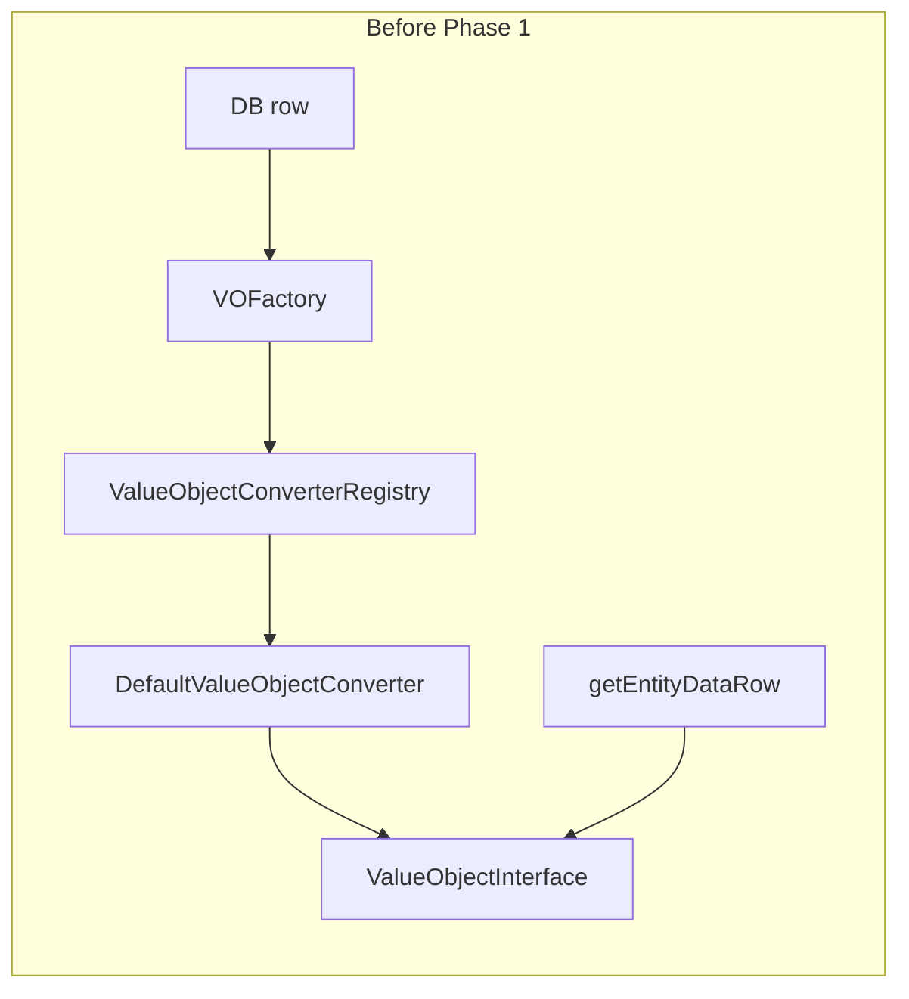
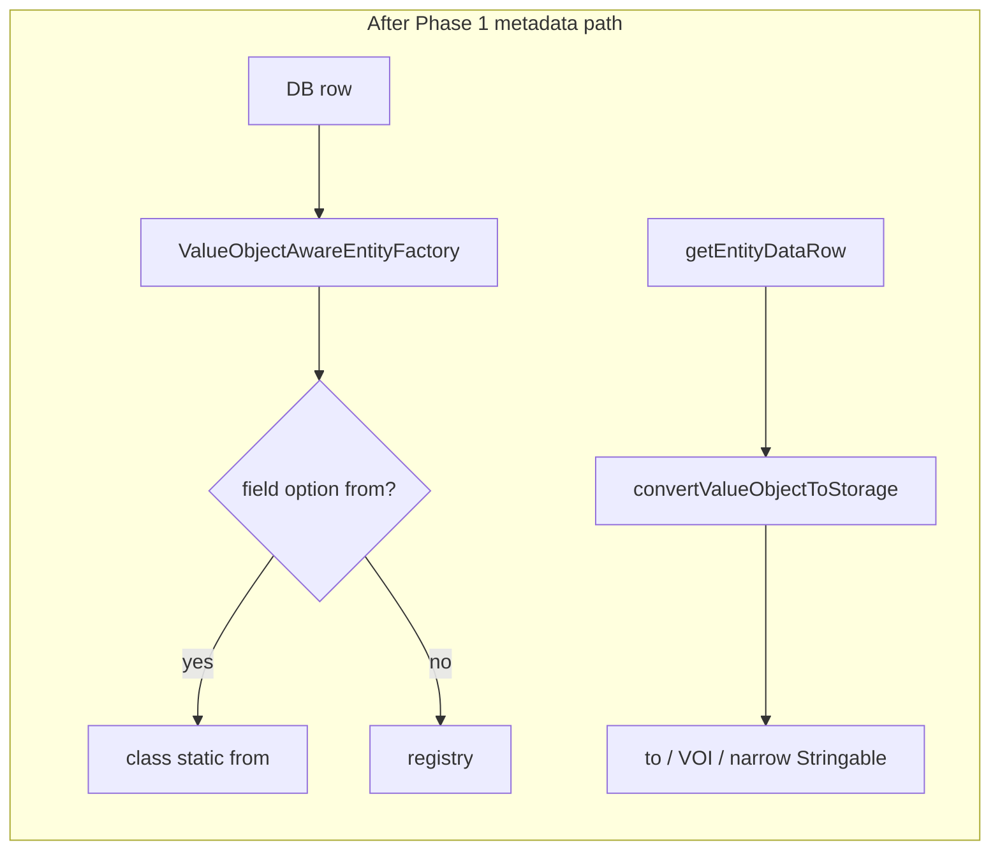

# RFC-003: Domain-Agnostic Value Object Mapping

## Status

**Phase 1 (MVP) — implemented in core** (from v1.6.0): metadata-based mapping for domain types without `ValueObjectInterface`—`class` / `valueObjectClass`, `from`, `to`, narrow `Stringable`, criteria alignment, and the implementation rules under Phase 1 in the [Migration Plan](#migration-plan). `ValueObjectConverterInterface` and the registry were left unchanged on purpose.

**Later phases** in this document (generalized converter API, more built-ins, deeper registry integration, aggregate-oriented metadata) are **proposals only**—not shipped yet; use them as a roadmap.

User-facing details: [VALUE_OBJECTS.md](../VALUE_OBJECTS.md).

## Context

Adaptive Entity Manager currently provides built-in Value Object support through
`ValueObjectInterface`. A domain Value Object is expected to implement methods
such as `toPrimitive()`, `fromPrimitive()`, and `equals()`.

This is convenient for simple examples, but it creates a serious limitation for
DDD-oriented code: the domain model must depend on an infrastructure contract
from AEM. For aggregate roots and Value Objects that belong to the domain layer,
this dependency is undesirable.

In DDD, persistence should adapt to the domain model, not the other way around.
The domain should be able to define its own factories, invariants, equality
rules, and serialization decisions without implementing AEM-specific
interfaces.

## Problem

The current design couples domain Value Objects to AEM:

```php
use Kabiroman\AEM\ValueObject\ValueObjectInterface;

final class Email implements ValueObjectInterface
{
    // Domain object now depends on infrastructure.
}
```

This causes several issues:

- Domain objects must expose persistence-oriented methods.
- Existing domain models cannot be mapped without modification.
- AEM-specific concepts leak into aggregate design.
- Value Object equality is forced into a single interface shape.
- Different conversion strategies, such as factory methods or custom mappers,
  are harder to express.

This is especially problematic when AEM is used as a mapper for DDD aggregates.
Aggregate roots should be restored and persisted through repositories and
mapping rules, while the aggregate itself should remain persistence-ignorant.

## Goals

- Allow domain Value Objects without AEM-specific interfaces.
- Support common PHP conventions such as `Stringable`, `JsonSerializable`,
  backed enums, and date/time objects.
- Move persistence conversion rules into metadata or infrastructure converters.
- Keep the current Value Object support available during migration.
- Make AEM more suitable as a mapper for aggregate roots.

## Non-Goals

- AEM should not become a full Doctrine ORM replacement.
- AEM should not require every Value Object to follow one universal factory
  method name.
- AEM should not enforce DDD tactical patterns on all users.
- AEM should not make lazy loading the default modeling style inside aggregate
  boundaries.

## Current Limitation

`Stringable` is a useful standard interface, but it only solves one direction:

```php
(string) $email; // Value Object -> storage value
```

It does not define how to restore the object:

```php
Email::fromString($value); // storage value -> Value Object
```

PHP has no standard interface for "create this object from a scalar". Because of
that, replacing `ValueObjectInterface` with `Stringable` would only move the
problem. A more general conversion layer is needed.

## Proposed Direction

Introduce a domain-agnostic conversion layer. AEM should map objects through
external conversion rules instead of requiring domain classes to implement
`ValueObjectInterface`.

The conversion layer should support:

- Explicit converters per class or per field.
- Metadata-defined factory and extractor methods.
- Built-in conventions for common PHP types.
- Backward compatibility with the existing `ValueObjectInterface`.

### Example: Clean Domain Value Object

```php
final readonly class Email implements Stringable
{
    private function __construct(private string $value)
    {
    }

    public static function fromString(string $value): self
    {
        if (!filter_var($value, FILTER_VALIDATE_EMAIL)) {
            throw new InvalidArgumentException('Invalid email address.');
        }

        return new self($value);
    }

    public function __toString(): string
    {
        return $this->value;
    }
}
```

This object does not know about AEM. It exposes a domain-friendly creation
method and a string representation.

### Example: Metadata-Based Mapping

```php
'email' => [
    'type' => 'value_object',
    'class' => Email::class,
    'from' => 'fromString',
    'to' => '__toString',
]
```

This is simple and expressive for scalar-backed Value Objects.

### Example: Converter-Based Mapping

```php
'email' => [
    'type' => 'value_object',
    'class' => Email::class,
    'converter' => EmailConverter::class,
]
```

```php
final class EmailConverter implements ValueConverterInterface
{
    public function toPHP(mixed $value, string $className, array $options = []): ?object
    {
        return $value === null ? null : Email::fromString((string) $value);
    }

    public function toStorage(mixed $value, array $options = []): mixed
    {
        return $value === null ? null : (string) $value;
    }
}
```

The converter belongs to infrastructure, not to the domain model.

## Recommended Converter Contract

The new converter contract should not mention `ValueObjectInterface`:

```php
interface ValueConverterInterface
{
    public function supports(string $className, array $options = []): bool;

    public function toPHP(mixed $value, string $className, array $options = []): mixed;

    public function toStorage(mixed $value, array $options = []): mixed;
}
```

Important difference from the current design:

- `toPHP()` returns `mixed`, not `?ValueObjectInterface`.
- `toStorage()` accepts `mixed`, not `?ValueObjectInterface`.
- The converter may handle Value Objects, enums, identifiers, collections, or
  other embeddable values.

## Built-In Conventions

AEM can provide default converters for common cases:

### Stringable

Use `__toString()` for storage conversion.

Restoration still requires metadata:

```php
'from' => 'fromString'
```

or a converter.

### JsonSerializable

Use `jsonSerialize()` for storage conversion when the field is configured as a
JSON-compatible value.

Restoration should be explicit because constructor and factory signatures vary
between domains.

### BackedEnum

Use `$enum->value` for storage and `EnumClass::from($value)` for restoration.

### DateTimeInterface

Continue supporting date/time conversion explicitly. Date formats should remain
metadata-configurable if different sources require different formats.

### Existing ValueObjectInterface

Keep the current interface as a legacy/default convention:

```php
$object->toPrimitive();
$className::fromPrimitive($value);
```

This allows existing users to migrate gradually.

## AEM as a DDD Aggregate Mapper

AEM can be a good fit for DDD aggregate mapping if it is positioned as a
persistence mapper rather than as a domain modeling framework.

Good use cases:

- Mapping aggregate roots from legacy databases.
- Hiding source-specific data shapes behind repositories.
- Reusing one mapper abstraction across DB, API, files, and other sources.
- Avoiding repetitive hand-written mappers for simple aggregate persistence.
- Incrementally migrating a legacy model toward richer domain objects.

Risks:

- Free loading of any entity can bypass aggregate boundaries.
- Lazy loading inside an aggregate can hide consistency problems.
- Reflection-based hydration can bypass constructors and invariants.
- Automatic persistence of inner entities can blur aggregate ownership.

Recommended DDD constraints:

- Repositories should expose aggregate roots, not arbitrary inner entities.
- Aggregate boundaries should be explicit in metadata.
- Lazy loading should be avoided inside aggregate consistency boundaries.
- Reconstitution should optionally use factory methods, not only reflection.
- Domain events and lifecycle callbacks should remain separate concepts.

## Aggregate Mapping Direction

For aggregate roots, AEM should eventually support a mapping style like:

```php
Order::class => [
    'aggregateRoot' => true,
    'reconstitute' => 'reconstitute',
    'fields' => [
        'id' => [
            'type' => 'value_object',
            'class' => OrderId::class,
            'converter' => OrderIdConverter::class,
        ],
        'customerEmail' => [
            'type' => 'value_object',
            'class' => Email::class,
            'from' => 'fromString',
            'to' => '__toString',
        ],
    ],
]
```

The aggregate can then define a domain-specific restoration method:

```php
final class Order
{
    public static function reconstitute(
        OrderId $id,
        Email $customerEmail,
        OrderStatus $status
    ): self {
        // Restore persisted state without exposing infrastructure concerns.
    }
}
```

This keeps persistence concerns in AEM metadata and converters, while the domain
model remains focused on invariants and behavior.

## Migration Plan

### Phase 1: Metadata-Based Mapping *(implemented in core)*

Delivered first, **without** changing `ValueObjectConverterInterface` or existing
registry converters:

- `class` / `valueObjectClass` (with conflict rules when both are set)
- `from` (static factory, one argument)
- `to` (instance method, no required parameters; optional when narrow `Stringable` applies)
- Narrow `Stringable` fallback where documented for `value_object` fields
- Criteria / persistence alignment for object values on those fields
- Built-in `ValueObjectInterface` and converter registry path **unchanged**

**Code paths today (for maintainers):** hydration and row extraction for `value_object` fields run through [`ValueObjectAwareEntityFactory`](../../src/ValueObjectAwareEntityFactory.php). Types backed only by [`ValueObjectConverterRegistry`](../../src/ValueObject/Converter/ValueObjectConverterRegistry.php) still follow `ValueObjectInterface` in the default setup. Arbitrary field options are readable via [`ClassMetadata::getFieldOption()`](../../src/Metadata/AbstractClassMetadata.php) (same idea as boolean `values`).

**Architecture (before → after Phase 1):**





**Implementation invariants (as shipped):**

- **Types:** resolve target class from metadata and align with the property’s **`ReflectionNamedType`**. **`ReflectionUnionType` / `ReflectionIntersectionType`** on `value_object` fields are rejected in this version with an explicit error.
- **`from`:** static call, one argument (storage value). **Validate** the return value with **`instanceof` of the target class** before assignment; surface configuration errors early instead of a late `TypeError`.
- **`to`:** instance method with no required parameters (e.g. `__toString`). **Narrow `Stringable` fallback** only for `value_object` fields when the runtime object matches the declared/target class and policy in [`VALUE_OBJECTS.md`](../VALUE_OBJECTS.md) applies—not for arbitrary `Stringable` objects elsewhere.
- **Nulls:** `null` from storage skips `from`; `null` on the property maps to `null` in the row without calling `to`.
- **`ValueObjectConverterInterface`:** intentionally **not** widened to `mixed` in Phase 1; doing so would break **LSP** for user-defined converters. A broader contract belongs in a **later** public API (new interface + adapter, or a major with migration).
- **Single extraction helper** (`convertValueObjectToStorage` / equivalent) drives both **flush (row)** and **criteria** so rules stay in one place.

**Phase 1 acceptance (definition of done):**

- Domain VO with metadata `class` or `valueObjectClass` + `from`/`to` (no AEM interface): hydrate and persist round-trip.
- Existing `ValueObjectInterface` metadata and tests remain valid without mandatory changes.
- Clear errors when `from` returns the wrong type or when the property type is union/intersection for this mapping.

**Not in Phase 1:** first-class `aggregateRoot` / `reconstitute` wiring, multi-column composite value objects, or a single sweeping rewrite of all `ValueObjectInterface` docs—those remain roadmap items (see later phases and [Aggregate Mapping Direction](#aggregate-mapping-direction)).

End-user documentation: [VALUE_OBJECTS.md](../VALUE_OBJECTS.md).

Introduce a new converter interface that operates on `mixed` values and does not
reference `ValueObjectInterface`.

Keep adapters for existing `ValueObjectConverterInterface` implementations.

(This was previously listed as “Phase 1”; implementation intentionally started
with metadata `from` / `to` instead.)

### Later Phase: Additional Metadata and Built-In Conventions

Extend field options (via `ClassMetadata::getFieldOption()` or equivalent) where
still missing, for example:

- `converter`, `format`, `nullable` (and any other keys still not first-class)

Provide or expand default handling for:

- Existing `ValueObjectInterface` *(already supported)*
- `BackedEnum`, `JsonSerializable`, `DateTimeInterface`, and other common shapes
  beyond the current metadata + registry split

### Later Phase: Deeper Registry Integration in Hydration / Extraction

Where it still pays off, reduce direct `ValueObjectInterface` checks in favor of
a single “is this field convertible?” path through the registry. Metadata-driven
domain VOs already use the factory rules described in Phase 1; this phase is
about further unification, not replacing what already works.

### Later Phase: Document DDD Usage

Expand documentation for:

- Clean domain Value Objects and aggregate-friendly mapping.
- Aggregate root repositories and reconstitution patterns.
- When not to use lazy loading.
- Migration from `ValueObjectInterface`.

## Compatibility Strategy

The current `ValueObjectInterface` should not be removed immediately.

Recommended compatibility path:

1. Keep `ValueObjectInterface` as a supported convention.
2. Mark it as optional rather than required.
3. Add new converter-based examples.
4. Update documentation to avoid recommending AEM interfaces in domain models.
5. Deprecate "all Value Objects must implement `ValueObjectInterface`" wording.

## Open Questions

- Should converter configuration live only in metadata, or also in `Config`?
- Should AEM provide a first-class `aggregateRoot` metadata option?
- Should reconstitution prefer named constructors, constructor injection, or
  reflection with private property assignment?
- Should lazy loading be disabled by default for aggregate internals?
- How much Doctrine compatibility should be preserved in aggregate-oriented
  APIs?

## Recommendation

Do not replace `ValueObjectInterface` with `Stringable` directly.

Instead, introduce a domain-agnostic conversion layer where `Stringable` is one
supported convention among several. This keeps AEM useful for simple projects,
while making it suitable for richer DDD models and aggregate mapping.

AEM's strongest position is as an adaptive persistence mapper: it can hide
legacy schemas, APIs, and mixed data sources behind repositories and metadata
without forcing the domain model to implement infrastructure contracts.
